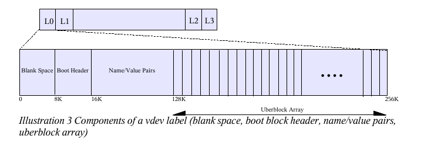
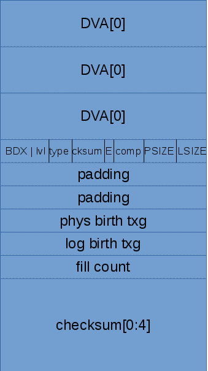

  * [ZFS](#zfs)
    * [Термины и сокращения](#Термины-и-сокращения)
    * [ZFS Label](#zfs-label)
      * [Виртуальные устройства (VDEV) и метки на них.](#Виртуальные-устройства-vdev-и-метки-на-них)
      * [Конфигурация пула (ZFS Label NVList)](#Конфигурация-пула-zfs-label-nvlist)
      * [Уберблоки (Uberblocks)](#Уберблоки-uberblocks)
      * [Просмотр меток](#Просмотр-меток)
    * [Указатели на блоки (Block Pointers)](#Указатели-на-блоки-block-pointers)
      * [Косвенные блоки (indirect blkptr) и размеры блоков](#Косвенные-блоки-indirect-blkptr-и-размеры-блоков)
      * [Заполненность блоков (fill/hole)](#Заполненность-блоков-fillhole)
      * [Встраиваемый BP (embedded blkptr)](#Встраиваемый-bp-embedded-blkptr)
      * [Gang-блоки (Gang Blocks)](#gang-блоки-gang-blocks)
      * [Типы объектов ZFS](#Типы-объектов-zfs)
    * [Объекты и слой DMU](#Объекты-и-слой-dmu)
      * [MOS](#mos)
      * [Косвенные блоки и объекты](#Косвенные-блоки-и-объекты)
    * [DBUF](#dbuf)
      * [Реализация COW-механизма в DBUF](#Реализация-cow-механизма-в-dbuf)
    * [Транзакционные группы (TXG)](#Транзакционные-группы-txg)
      * [Особенности реализаций транзакционных групп](#Особенности-реализаций-транзакционных-групп)
      * [Задержки транзакций (ZFS transaction delay)](#Задержки-транзакций-zfs-transaction-delay)
# ZFS

В данном документе представлены результаты исследований исходников ZFSonLinux-0.6.5.4.
В некоторых случаях используются иллюстрации из презентаций и документов Oracle, OpenSolaris, FreeBSD.
Это используется в тех случаях, когда документация из других реализаций ZFS не конфликтует с ZoL.

## Термины и сокращения 

Обратите внимание, к примеру, на разницу между zfs и ZFS:

* ZFS - под этим термином понимается вся система;

* zfs - только файловая система в ZFS (которая опирается на ZPL);

* ZPL - (ZFS POSIX Layer) подсистема, предоставляющая API для работы файловой системы zfs;

* ZVOL - подсистема блочных устройств. В некоторых случаях является синонимом фразы "объект типа DMU_OT_ZVOL";

* zvol - блочное устройство, выделяемое из пула в виде датасета.

* vdev (VDEV) - узел дерева, из которого состоит пул. Если узел является листовым, то это реальное устройство, если нет - виртуальное (mirror, raidz etc);

* SPA - (Storage Pool Allocator) - подсистема, отвечающая за управление занятым/свободным местом в пуле. Оперирует указателями на блоки (blkptr);

* blkptr (BP,БП) - указатель на область/области диска. Может быть пустым (HOLE) и заполненным (FILL);

* ZIO - (ZFS I/O) - подсистема ввода/вывода. Управляет процессом записи/чтения данных с дисков;

* ARC - (Adaptive Replacement Cache) - подсистема, отвечающая за кэширование данных. Через неё проходят все запросы к ZIO;

* arc, l2arc - кэш на чтение первого (память) и второго уровня (диски).

* DMU - (Data Managment Unit) - подсистема, оперирующая объектами ZFS, которые в свою очередь опираются на blkptr'ы. Все объекты описываются при помощи dnode-стуртуры.

* dnode (DN) - (data node) - структура, описывающая некий объект ZFS.

* `*_phys` - суффикс, который соответствует OnDisk-формату. Например, `dnode_phys`, `objset_phys`;

* OnDisk-формат - формат хранения данных непосредственно на физических носителях);

* DSL - (Datasets and Snapshots Layer) - подсистема, оперирующая датасетами и снапшотами. Опирается на DMU.

* ZIL - (ZFS Intent Log) - подсистема, необходимая для обработки синхронных запросов на запись. Может быть представлена в виде устройства SLOG (LogZilla, кэш на запись).

* ZAP - (ZFS Attibute Processor) - подсистема, необходимая для хранения свойств (аттрибутов) различных объектов ZFS, например, свойства файлов или датасетов.

* TXG - (Transaction Group) - группа транзакций. Используется в DMU.

* DBUF - (DMU Buffer) - подсистема, отвечающая за транзакционную запись и COW-механизм.

* Uberblock - блок данных на диске, характеризующий состояние системы на определённый момент времени (точнее - для определённой транзакционной группы).

* ZFS Label - метка на диске/разделе, по которой определяется принадлежность к ZFS.

* `Metaslab, Metaslab Group, Metaslab Class` - объекты, отвечающие за выделение места на в пуле. Хранят информацию о свободном/занятом месте. Имеют OnDisk-формат. Относятся к SPA.

* Indirect blocks - косвенные блоки;

* DVA - (Device Virtual Address) - 128-битный адрес, определяющий область на vdev'е, расположенную по заданному смещению и имеющую заданный размер;

* Gang block - набор блоков небольшого размера, которые предствляются как единый блок. Используются в случае сильной фрагментации;

* BIO (Block IO) - подсистема блочного ввода/выовда ядра Linux;

* NVPair (NVList) - списки пар имя-значение;

* guid - GUID;

* shift - логарифм по основанию 2 для некоторого значения. Например, утверждение "block shift = 9" эквивалентно утверждению "block size = 512b".

* P2PHASE, P2ROUNDUP, P2ALIGN - битовые операции (округление вниз, округление вверх, выравнивание по степеням двойки);

* MOS (Meta Object Set) - объект содержащий информацию о пуле. TODO: уточнить.

* `MetaNode` - метаобъект в датасете или пуле. Содержит в себе дерево, листья которого указывают на объекты датасета/пула. Всегда имеет номер 0;


Часть из предствленных термиров изображена на рис. @fig:zfs-src.

"){#fig:zfs-src}


## ZFS Label

В данном разделе описаны особенности меток ZFS, и свзязанных с ними процессов.

Метки ZFS присутствуют на физическом носителе, если на него производится запись данных (обычные диски в raidz, mirros и slog).
Для повышения надёжности на диске присутствуют 4 метки - две в начале диска и две в конце (по номерам, соответственно, 1, 2 и 3, 4).
Кроме того, при обновлении данных в метках вначале обновляются первая и третья, а потом - вторая и четвёртая.
Это также повышает отказоустойчивость: если произошла ошибка при записи одной из пар, то может использоваться другая пара.

Рассмотрим структуры меток (рис. @fig:zfs-label). В каждой метке присутствуют NVList с описанием конфигурации пула и массив уберблоков.
Перед первой парой меток дополнительно отступается свободное пространство (8k) под EFI-метки и место под `Boot Block Header` (8k).
В текущей реализации `Boot Block Header` просто заполняется нулями с контрольной суммой от этих нулей при создании меток.


{#fig:zfs-label}

### Виртуальные устройства (VDEV) и метки на них.


| Тип vdev | Описание                                          | Тип узла      | Тип метки     |
| -------- | ------------------------------------------------- | ------------- | ------------- |
| disk     | физическое устройство, на котором хранятся данные | leaf          | self          |
| file     | файл, на котором хранятся данные                  | leaf          | self          |
| log      | кэш на запись                                     | leaf/internal | property      |
| cache    | кэш на чтение                                     | aux           | aux           |
| mirror   | RAID-массив                                       | internal      | self/children |
| raidz    | RAID-массив                                       | internal      | self/children |
| missing  | устройство, не найденное во время импорта         | leaf          | None          |
| root     | корневой vdev пула                                | root          | all           |
| spare    | устройство для горячей замены                     | aux           | aux           |

Table: Типы виртуальных устройств пула {#tbl:vdev-types}

В табл. {@tbl:vdev-types} представлено описание виртуальных устройств, из которых может состоять пул. 
Если исходить из практических соображений (возможностей команды `zpool`), то дерево vdev'ов в предельном случае может состоять из:

* корень `root` (root vdev);

* промежуточные узлы `internal` (mirror, raidz);

* листовые узлы `leaf` (disk, file);

* `aux`-устройства (spare, cache);

Причём, промежуточные узлы могут располагаться на нескольких уровнях. 
К примеру, программа `ztest` при проведении тестирования может создавать `"RAID610"` - страйп из зеркал, каждое из которых
состоит из нескольких `raidz1`.
Однако, в на практике, не существует способа создания таких "ветвистых" пулов. Поэтому примем следующую терминологию
(и в дальнейшем будем ей пользоваться):

* leaf - листовые узлы (disk, file);

* top-level vdev - промежуточные узлы (mirror, raidz);

* root - корневой vdev пула;

* aux - устройства, не хранящие данные (cache и spare);

* log - листовой или промежуточный узел, у которого выставлен флаг `is_log`;

Рассмотрим рис. @fig:zfs-raid10-raid1log. В нём представлен RAID10 пул с RAID1-кэшем на запись.
Выделенная штриховкой область - vdev'ы, состояние которых будет отражено в метках устройств `sdq1` и `sdq2`.
Желтым выделен vdev, у которого установлен флаг `is_log`. Если бы лог-устройство было бы не зеркалом, а обычными
дисками или страйпами, то соответсвующий флаг был бы установлен у них.

"){#fig:zfs-raid10-raid1log}

Таким образом, в метках, хранящихся на дисках/файлах отражено состояние данного "листового" vdev'a, его "братьев" и родителя.
А также индекс родителя в массиве `root.vdev_tree` (где root - корневой vdev пула).

Пусть мы создаём следующий пул (см. рис @fig:zfs-raid10-raid1log):

\newpage

```bash
zpool create -f tank \
	mirror /dev/sdq1 /dev/sdq2 \
	mirror /dev/sdq3 /dev/sdq4 \
	log mirror /dev/sdq5 /dev/sdq6 \
	cache /dev/sdq7 /dev/sdq8 \
	spare /dev/sdq9 
zpool status
#  pool: tank
# state: ONLINE
#  scan: none requested
#config:
#
#        NAME        STATE     READ WRITE CKSUM
#        tank        ONLINE       0     0     0
#          mirror-0  ONLINE       0     0     0
#            sdq1    ONLINE       0     0     0
#            sdq2    ONLINE       0     0     0
#          mirror-1  ONLINE       0     0     0
#            sdq3    ONLINE       0     0     0
#            sdq4    ONLINE       0     0     0
#        logs
#          mirror-2  ONLINE       0     0     0
#            sdq5    ONLINE       0     0     0
#            sdq6    ONLINE       0     0     0
#        cache
#          sdq7      ONLINE       0     0     0
#          sdq8      ONLINE       0     0     0
#        spares
#          sdq9      AVAIL   
#
#errors: No known data errors
```

Информация о структуре пула будет отражена только в  метках дисков `sdq[1-6]`. О дисках `sdq[7-9]` на этих метках не будет никакой
информации, т.к. эти диски относятся к типу `aux` `vdev`. `aux`-устройства хранят в своих метках только 3 составляющие: версия пула, тип устройства и guid устройства.
Каким же образом ZFS узнаёт, где их искать при импорте? Ответ на этот вопрос - в метаданных пула. Именно там и хранятся пути к этим устройствам.
Таким образом, при импорте, на этапе анализа меток aux-устройства не участвуют в "сборе" дерева пула. Это происходит уже после получения `uberblock`'a и чтения метаданных (MOS).
В дополнение к этому, ZFS спокойно относится к созданию пулов в которых присутствуют устройства с `aux`-метками (нет необходимости в ключе `-f` для команды `zpool`).
Более того, при импорте на этих устройствах затираются данные - ZFS пишет туда свои метки и ей безразлично, хранится ли там информация.


### Конфигурация пула (ZFS Label NVList)

В NVList хранится информация о пуле и части соседних с текущим vdev'ов.
Как было раннее указано, хранится информация только о важных (с точки зрения целостности данных) vdev'ах - диски с данными и slog.
Другие виды vdev'ов (l2cache, spare) хранятся вне меток (непосредственно внутри пула).
"Соседние" vdev'ы - те устройства (виртуальные и реальные) с которыми граничит данное устройство в дереве vdev'ов пула.
Именно о них и хранится информация в метке диска/файла.
Одна из составляющих метки - список конфигурационных параметров пула.
NVList конфигурации пула включает в себя следующие элементы:

* версия OnDisk-формата;

* имя пула;

* состояние пула (активный, экспортированный, уничтоженный);

* номер транзакционной группы, в которой была записана метка;

* guid пула;

* guid vdev'а верхнего уровня;

* дерево соседних vdev'ов;

Дерево vdev'ов содержит элементы - массив, состоящий из элементов:

* type: имя типа (диск, файл, зеркало и т.п.);

* id: уникальный индекс vdev'а в родительском vdev'е;

* guid vdev'a;

* path: путь к устройству (только для "листовых" vdev'ов - диски, файлы)

* metaslab_array: номер объекта (внутри пула), который содержит массив номеров объектов, каждый из которых соответствует объекту, описывающему metaslab;

* metaslab_shift: log2 от размера метаслаба;

* ashift (allocatable shift): log2 от размера минимальной области, которая может быть выделена в top-level vdev'е. Например, если ashift=9, то в данном vdev'е области будут выделяться не меньшие, чем 512 байт;

* asize (allocatable size): количество байт, которое можно выделить в данном vdev'е. Грубо говоря, общий объем всех дочерних vdev'ов;

* children: список дочерних vdev'ов;


### Уберблоки (Uberblocks)

Следующий элемент метки - уберблоки (Uberblocks). В текущей реализации используется массив из 128 уберблоков. Размер уберблока - 1k.
ZFS работает с уберблоками как с кольцевым буффером: при обновлении перезаписывается самый старый уберблок.
Таким образом, теоретически, мы в любой момент времени имеем до 128 readonly состояний файловой системы.
При поиске уберблока (во время операции импорта) выбирается уберблок, соответствующий следующим критериям:

* верная контрольная сумма;

* наибольшее значение временной метки;

* наибольшее значение номера транзакционной группы;

В случае, если существуют проблемы при импорте пула, ZFS позволяет производить операцию отмотки (REWIND), которая соответствует опциям `-F` и `-X` команды `zpool import`.
Отмотка позволяет "откатиться" в одно из предыдущих состояний файловой системы посредством выбора более "молодого" уберблока (своего рода перемещение во времени в рамках последних 128 транзакций).
Кроме того, существует опция `-T`, которая позволяет задать конкретный номер транзакции, к которой нужно откатиться.

Уберблок состоит из следующих элементов:

* ub_magic: уникальное "магическое" число (magic number), которое позволяет не только определить, что область на диске содержит уберблок, но определить порядок байт,
определённый в пуле (ZFS пулы переносимы между системами с различными `endianness`):

	- Big-Endian: 0x00bab10c (oo-ba-block)
	- Little-Endian: 0xcb1ba00

* ub_version: версия OnDisk-формата (см. версию в NVList)

* ub_txg: номер транзакционной группы, в которой был записан данный уберблок. Должен быть не меньше, чем параметр `txg` в метке;

* ub_guid_sum: сумма guid всех листовых vdev'ов. Используется для проверки доступности всех vdev'ов пула. Если это поле не совпадает с вычисленной при импорте суммой, значит было потеряно устройство;

* ub_timestamp: временная метка на момент записи уберблока;

* ub_rootbp: blktr, указывающий на расположение MOS (Meta Object Set) данного пула;


### Просмотр меток

Для просмотра содержимого меток пула можно воспользоваться командой `zdb <pool-name>`. 
Или `zdb <pool-name> -e -p <dir>` если пул был экспортирован и файлы/диски, из которых состоит пул находятся в директории `<dir>`.


## Указатели на блоки (Block Pointers)

Данные передаются между памятью и диском в единицах, которые называются блоками. Указатель на блок (структура blkptr_t) -
это 128-битная структура, используемая для описания физического расположения блока, его верификации. Она описывает блоки данных на диске.
Структура BP представлена на рис. @fig:zfs-blkptr-struct.

{#fig:zfs-blkptr-struct}


На рис. 5 представлена структура DVA (Device Virtual Address). Она состоит из следующих элементов:

* asize (allocated size): размер данных (в единицах ashift vdev'а верхнего уровня), на которые указывает данный BP.
Стоит отметить, что данный параметр имеет наибольший размер (в битах) по отношению к LSIZE и PSIZE (см. поля BP), т.к.
дополнительно может понадобиться место для хранения данных GANG-блоков, RAIDZ и 3-х DVA на один BP.

* grid: зарезервировано для raidz;

* vdev: уникальный номер vdev'а в пуле;

* offset: смещение в единицах ashift, которое характеризует расположение блока в пуле ($phys addr = (offset \ll ashift) + Label_{size}$, где $Label_{size} = 4MB$ = 0.5МБ отступ первых 2-х меток + 3.5МБ свободного места)

* G (Gang): флаг, характиризующий, является ли блок Gang-блоком (0 - нет, 1 - да).

")

Как было отмечено выше, в BP может содержаться до 3-х DVA. Это значит, что один BP может ссылаться на данные в 3-х различных местах пула.
Это сделано для повышения надёжности хранения данных, в особенности - метаданных. Ведь потеря метаданных (например, косвенного блока или dnode'ы) может оказать существенное влияние на целостность данных в пуле.
К примеру, если мы "потеряем" данные, на которые указывает `ub_rootbp` уберблока, то мы потеряем все данные. Чтобы не допустить это, используется избыточность для метаданных.
Количество избыточных DVA зависит от вида BP (данные/метаданные) и типа метаданных (чем выше по дереву - тем большая избыточность).
На рис. 6-7 изображены примеры количества и расположения блоков на различных видах пулов.


")


")


Избыточность по DVA задаётся посредством параметра `copies` в свойствах датасета 
(для существующего датасета выполнение команды `zfs set <pool/ds> copies=N` приведёт к тому, 
что новые данные будут дублироваться, однако на старые блоки это не окажет влияния. Также этот параметр можно задавать при создании датасета).


Рассмотрим подробнее поля bklptr_t, представленные на рис. 4:

* `DVA[3]`: 3 128-битных адреса;

* B (byteorder, endianness): флаг, определяющий порядок байт;

* D (dedup): флаг, определяющий наличие дедупликации;

* X (encryption): флаг, определяющий наличие шифрования (в текущей версии не поддерживается);

* lvl (indirection level): уровень косвенности для косвенных блоков. Блоки, указывающие на данные содержат значение 0 (`L0`).

* type: тип объекта, к которому относится данный BP (см. ниже, константы вида `DMU_OT_*`);

* cksum: тип контрольной суммы и включена ли она. Значение этого поля интерпретируется в зависимости от типа блока;

* E: флаг, определяющий, является ли BP встроенным (embedded BP, см. ниже). В старых версиях ZFS отсутствует;

* comp: тип компрессии и включена ли она;

* padding: неиспользуемые/зарезервированные поля (пока что используются в целях выравнивания);

* phys birth txg (physical birth txg): номер транзакции, в результате которой было выделено место под данные, на который указывает данный BP.
В случае, если phys birth txg == 0, то считается, что блок был данных был выделен в тот же момент, когда появился данный BP (т.е. phys birth txt == log birth txt).

* log birth txg (logical birth txg): номер транзакции, в результате которой появился данный BP;

* fill count: количество заполненных блоков, которые находятся ниже данного в дереве косвенных блоков. Для блока, указывающего на данные (`L0`) fill count всегда равен 1;

* `checksum[4]`: значение контрольной суммы данного блока;


### Косвенные блоки (indirect blkptr) и размеры блоков

Размеры BP, как правило, ограничены параметрами датасетов `volblocksize (zvol)` и `recordsize (zfs)`. В свою очередь, на эти параметры накладываются следующие ограничения:

* blocksize не может быть меньше, чем `ashift` (невозможно выделить блоки, меньшие, чем размер логического блока дисков пула);
* blocksize не может быть больше, чем `zfs_max_recordsize` (параметр модуля ядра);

Параметр `zfs_max_recordsize` по умолчанию равен 1М, максимальное значение - 16M. Теоретический максимум этого значения равен максимальному значению поля `LSIZE * ashift`
в BP (т.е. 32M), однако поле `dn_datablkszsec` может хранить не более, чем `32M - 512` байт. Поэтому максимум `zfs_max_recordsize` ограничен 16МБ (P2PHASE от 32M - 512).


В случае, если возникает необходимость хранения данных больших, чем размер блока, необходимы косвенные блоки (indirect blocks).
Косвенные блоки образуют дерево косвенных блоков (рис. 8). На каждый узел дерева выделяется место, равное `DNODES_PER_BLOCK` (в данный момент - 16k).
Учитывая размер blkptr равный 128B, в косвенный блок может содержать до 128 указателей на блоки. Место под косвенные блоки выделяется сразу и заполняется по мере наполнения
соответствующего узла.

")


### Заполненность блоков (fill/hole)

Каждый blkptr может либо указывать на данные (в случае, если в хотя бы один DVA в нём ненулевой), либо быть "дыркой" (HOLE) - пустой указатель.
В ранних версиях пустые указатели имели все поля, равные нулю. В новых версиях пулов, в которых включена фича "hole_birth" у данного вида указателей
присутствует поле birth txg, которое характеризует время (номер транзакционной группы) появления данного указателя.
Данная фича позволяет сократить объем данных, пересылаемых при помощи `zfs send|recv`.


### Встраиваемый BP (embedded blkptr)

Ещё одна фича новых пулов - "embedded_data". Это особый вид BP, которые содержат данные в самих себе. Это сделано для того, чтобы
уменьшить время доступа к мелким блокам: вместо того, чтобы идти по адресу, содержащемся в DVA, мы можем сразу считать данные из полей BP.
TODO: данный вид BP имеет структуру, отличную от обычных BP, кроме того, запись таких блоков производится иначе.
Так что в дальнейшем сюда можно будет добавить их описание.

### Gang-блоки (Gang Blocks)

Как было замечено выше, в случае, если ZFS не может выделить места, достаточного для блока, она выделяет несколько блоков меньшего размера,
и оперирует ими как одним целым.
TODO: так же, как и embedded BP, Gang-блоки имеют несколько иное поведение при операциях ввода/вывода. Это тоже можно будет добавить.


### Типы объектов ZFS

Одно из полей `blkptr_t` - `type` характеризует тип объекта, к которому относится данный BP.
В табл. 2 представлены несколько таких типов.


| Название типа             | Описание/тип                    |
| ------------------------- | ------------------------------- |
| DMU_OT_NONE               | -                               |
| General types:            |                                 |
| DMU_OT_OBJECT_DIRECTORY   | Объект ZAP                      |
| DMU_OT_OBJECT_ARRAY       | UINT64                          |
| DMU_OT_PACKED_NVLIST      | UINT8 (XDR-кодированный nvlist) |
| DMU_OT_PACKED_NVLIST_SIZE | UINT64                          |
| DMU_OT_BPOBJ,             | UINT64                          |
| DMU_OT_BPOBJ_HDR,         | UINT64                          |
| SPA types:                |                                 |
| DMU_OT_SPACE_MAP_HEADER   | UINT64                          |
| DMU_OT_SPACE_MAP          | UINT64                          |
| ZIL types:                |                                 |
| DMU_OT_INTENT_LOG         | UINT64                          |
| ZVOL types:               |                                 |
| DMU_OT_ZVOL               | UINT8                           |
| DMU_OT_ZVOL_PROP          | Объект ZAP                      |

Table: Некоторые виды DMU объектов (2)

Например, в датасете `zvol` присутствует 2 объекта - `ZVOL` и `ZVOL_PROP`. 
Первый объект относится к данным, которые представляет `zvol`, второй - свойства `zvol`'а (например, `volblocksize`).
Все BP, на которые прямым и косвенным образом ссылается первый объект в поле `type` будут содержать значение `DMU_OT_ZVOL`.


## Объекты и слой DMU

В данном пункте будут подробно рассмотрены объекты `ZFS`, т.к. они составляют большую часть системы
и являются абстракцией, упрощающей работу с `BP`.

Основной структурой, связанной с объектами является `dnode`, которая представлена в `OnDisk`-формате в виде `dnode_phys`.
Рассмотрим её основные поля:

* `dn_type`: тип объекта, с которым связана данная DN (`dmu_object_type_t`);

* `dn_indblkshift`: log2 от `indirect block size` - размера косвенных блоков;

* `dn_nlevels`: число уровней косвенности. Если 1, то `dn_blkptr` указывает на блоки данных;

* `dn_nblkptr`: длина поля dn_nblkptr (точнее - количество задействованных указателей). Значения - от 1 до 3;

* `dn_bonustype`: тип данных в bonus-буффере;

* `dn_checksum`: тип контрольной суммы (`enum zio_checksum`);

* `dn_compress`: тип сжатия (`enum zio_compress`);

* `dn_flags`: флаги
	- `DNODE_FLAG_USED_BYTES (1<<0)`: dn_used использует байты? если нет, то `dn_used` в качестве единиц использует `SPA_MINBLOCKSIZE` (512b)
	- `DNODE_FLAG_USERUSED_ACCOUNTED (1<<1)`: TODO
	- `DNODE_FLAG_SPILL_BLKPTR (1<<2)`: имеет ли данный объект системные аттрибуты в bonus-буффере (TODO: уточнить)

* `dn_datablkszsec`: размер блока данных в 512b секторах;

* `dn_bonuslen`: длина dn_bonus (bonus-буффер в объединении dn_nblkptr);

* `dn_pad2[4]`: зарезервировано/дополнение для выравнивания

* `dn_maxblkid`: наибольший ID выделенного блока (TODO: описать, как вычисляется/используется)

* `dn_used`: объём используемого дискового пространства (в байтах или секторах в зависимости от `dn_flags`)

* `dn_pad3[4]`: зарезервировано/дополнение для выравнивания

* `dn_blkptr`: объединение, которое может использоваться тремя различными способами:
```
0       64      128     192     256     320     384     448 (offset)
+---------------+---------------+---------------+-------+
| dn_blkptr[0]  | dn_blkptr[1]  | dn_blkptr[2]  | /     |
+---------------+---------------+---------------+-------+
| dn_blkptr[0]  | dn_bonus[0..319]                      |
+---------------+-----------------------+---------------+
| dn_blkptr[0]  | /                     | dn_spill      |
+---------------+-----------------------+---------------+
```

### MOS

TODO: добавить описание Meta Objset пула - метаобъекта (контейнера объектов) пула, в котором содержится
дополнительная информация о конфигурации пула, директории датасетов (DSL directory), карты датасетов (DSL child map),
метаобъекты датасетов (Dataset), метаслабы, карты пространств и другие виды объектов.
Также можно добавить пример получения доступа к датасету:
`MOS -> object=1.root_dataset -> ... linked list ... -> DSL directory (parent) -> DSL directory (child) -> "DSL dataset".bp -> Dataset`


### Косвенные блоки и объекты

dnode предоставляет механизмы работы с косвенными блоками. Рассмотрим датасет типа ZVOL.
После создания он состоит из следующих компонентов:

* Meta Node (можно получить через макрос `DMU_META_DNODE(objset)`), номер объекта равен 0;

* `ZVOL`-объект, номер объекта равен 1;

* `ZVOL_PROP`-объект, номер объекта равен 2;

Рассмотрим объект `Meta Node`. Данный объект представляет собой дерево из $levels$ уровней.
Значение $levels = lvl$ должно удовлетворять следующему условию:

$$ nblkptr * 2 ^ {(datablkshift + (lvl - 1) * (indblkshift - BPSHIFT))} >= MAX\_OBJECT * size_{dnode} $$, где 

* `nblkptr`, `datashift`, `indblkshift` - соответствующие поля структуры `dnode`;

* `BPSHIFT (SPA_BLKPTRSHIFT)` - размер структуры blkptr_t (128b);

* `MAX_OBJECT (DN_MAX_OBJECT)` - максимальный размер объекта ($2 ^ {48}$ байт);

* $size_{dnode}$ - размер структуры `dnode_phys` в байтах;

Если выполнить преобразования:

* Размер блока данных в байтах: $blksize = 2 ^ {datablkshift}$;

* Количество BP, которые можно разместить в одном косвенном блоке: $ind\_per\_bp = {(2 ^ {ind}) / (2 ^ {BPSHIFT})}$;

* Максимальный размер объекта, состоящего из `dnode_phys` в байтах: $max\_obj = MAX\_OBJECT * size_{dnode}$;

То получим:

$$ nblkptr * blksize *  ind\_per\_bp ^ {lvl-1} >= max\_obj$$

Учитывая, что количество элементов в дереве на глубине $lvl$ равно $ind\_per\_bp ^ {lvl}$,
то неравенство отражает тот факт, дерево должно быть достаточной глубины, для того, чтобы
вместить в себя метаобъект максимально возможного размера.
Например, `dnode`, в котором `levels = 3` и `dn_nblkptr = 2` может оперировать с объектом, 
который состоит из $2 * 128 ^ {3 - 1}$ блоков (128 - количество косвенных блоков, умещающихся на одном уровне).

`MetaNode` (объект с нулевым индексом) содержит в себе все объекты датасета. 
В случае `ZVOL`-датасета, там хранятся два объекта `DMU_OT_ZVOL` и `DMU_OT_ZVOL_PROP`.

В объекте `DMU_OT_ZVOL` также могут использоваться косвенные блоки.

Важно отметить, что в объекте `MetaNode` хранится дерево, состоящее из `dnode_phys`,
а в качестве ссылок на узлы используются указатели `dnode_phys.dn_blkptr`.
А в объекте типа `ZVOL` дерево состоит только из `blkptr_t`, 
в качестве ссылок там используются `DVA` (см. рис. 8).

Рассмотрим алгоритм обхода косвенных блоков (из zdb.c):

```c

void traverse_indirect(int objset, int object, int level, int blkid, bp) {
	// level: N
	// objset:  number in parent MetaNode object tree
	// bp:  current bp with level = L(N)
	blkptr_t *cbp; // child bp with level = L(N - 1)

	do_something(bp);

	if (BP_GET_LEVEL(bp) > 0 && !BP_IS_HOLE(bp)) {
		arc_buf_t *buf;
		// element per block = bp.lsize / sizeof(bp)
		int epb = BP_GET_LSIZE(bp) >> SPA_BLKPTRSHIFT; 
		buf = arc_read(bp); //pseudo-code
		for(i = 0; i < epb; i++, cbp++)
		{
			traverse_indirect(
				objset, 
				object, 
				level - 1, 
				blkid * epb + i, 
				cbp
			);
		}
		
	}

}
```

На рис. 9 изображено дерево, из которого состоит объект `DMU_OT_DNODE`. Если сравнить его с деревом blkptr (рис. 8),
то заметно два отличия: корень и листья в метаобъекте являются элементами `dnode_phys`.
На корень этого дерева указывает объект типа dataset из метаданных пула. А листья - указывают на объекты (метаданные) самого датасета.

")


## DBUF

DBUF (DMU Buffer) - подсистема, отвечающая за чтение и запись данных в ARC (который, в свою очередь, либо от отдаёт кэшированое значение, либо перенаправляет вызовы в ZIO).
С этой подсистемой связано понятие "грязных" буферов (dirty buffers). Они содержат записи (dirty records), которые были изменены и нуждаются в сбросе на диск.
Кроме того, эта подсистема связана с механизмом транзакций - сброс данных на диск проходит в рамках транзакционной группы.

На рис. 10 представлена диаграмма состояний dbuf.

")

Рассмотрим действия, при помощи которых происходит переход из одного состояния в другое (`enum dbuf_states`):

* $Alloc \rightarrow Uncached$ - получен запрос на выделение памяти для буфера;

* $Uncached \rightarrow Read$ - инициировано чтение данных, на которые ссылается некий blkptr.

* $Read \rightarrow Cached$ - данные были прочитаны с диска/кэша;

* $Uncached \rightarrow Fill$ - получен запрос на запись неких данных в dbuf;

* $Fill \rightarrow Cached$ - запрос на запись данных в dbuf завершён;

* $Uncached \rightarrow NotFill$ - оставить буфер пустым;

* $Cached \rightarrow Evict$ - очистка буфера;

* $NotFill \rightarrow Evict$ - очистка незаполненного буфера;

Заполнение `Fill` буфера производится в случае, если записываемые данные равны размеру буфера. В таком случае чтение данных с диска производиться не будет (TODO: уточнить).

`NotFill` в данный момент устанавливается в функции `dmu_buf_will_not_fill` (аналог `dmu_buf_will_fill`), которая вызывается в `dmu_prealloc`, которая
в свою очередь, раньше использовалась для обрабоки запросов `zvol_write`. В данный момент `dmu_prealloc` не используется в `zvol_write`, соответственно, буферы в состоянии
NotFill не используются.

"Изгнание" (`Evicting`) производится при вызове `dnode_evict_dbufs`. В этом случае из буфера удаляются данные,
указатель на данные (очищается blkptr), а сам буфер удаляется из хеш-таблицы dbuf'ов и из дерева dbuf'ов в `dnode`.


### Реализация COW-механизма в DBUF

TODO: в этом разделе будет разъяснён механизм "восходящего" (вверх по дереву косвенных блоков и вверх по дереву объектов)
записи данных. Но он будет добавлен после того, как будет закончен раздел по ZIO.
Также тут будет описание работы функции `dbuf_hold`.


## Транзакционные группы (TXG)

В ZFS присутствует концепция транзакционной записи данных. Транзакционность предоставляет возможность "атомарной" записи блоков данных:
в случае возникновения ошибок при записи, все новые данные будут отброшены. Также это позволяет объединять запись нескольких блоков
в одну операцию, что добавляет некоторую последовательность записи (sequential writings), которая увеличивает быстродействие.
Кроме того, номера транзакционных групп могут использоваться для определения "возраста" блоков при "лечении", импорте или отправке пула.

Для увеличения производительности запись производится в рамках транзакционных групп (`txg`).
Обычно транзакционная группа ассоциируется с некоторым числом (номером транзакционной группы).

Рассмотрим вначале состояния, в которых может пребывать `TXG` (всего их 3, задаётся макросом `TXG_CONCURRENT_STATES`):

1. Opening - транзакционная группа "открыта" для добавления новых транзакций.

2. Quiescsing - освобождаются все блокировки, которыми захватываются транзакции в группе, группа переходит в состояние "стабилизации".

3. Syncing - после стабилизации группа переходит в состояние синхронизации - записи данных на диск.

Как было замечено, транзакционные группы идентифицируются при помощи номеров (типа `uint64_t`).
Структуры, хранящие данные групп имеют размер, равный 4 (`TXG_SIZE`, следующая после `TXG_CONCURRENT_STATES` степень двойки). 
Таким образом, есть 4 состояния:

* открытое;

* стабилизированное;

* синхронизирующееся;

* синхронизированное;

Благодаря битовой маске, равной 3 (`TXG_MASK = TXG_SIZE - 1`) и инкрементации номера транзакций, эти структуры образуют подобие кольцевого буфера.

Один из авторов ZFS утверждал, что можно было обойтись без состояния "стабилизации", однако это повлекло бы за собой переписывание большого объёма кода.

Рассмотрим использование данного механизма на примере функции `zvol_write` (`zvol.c`). 
Данная функция вызвывается в случае, если блочному устройству `zvol` пришёл запрос на запись.
Функция принимает в качестве аргумента структуру тип `bio` (`<linux-src>/include/linux/blk-types.h`), 
которая содержит в себе флаги (запись/чтение, сброс), "приватные" данные блочного устройства, смещение и размер данных, и буфер для данных.

```c
static int zvol_write(struct bio *bio)
{
	zvol_state_t *zv = bio->bi_bdev->bd_disk->private_data;
	uint64_t offset = BIO_BI_SECTOR(bio) << 9;
	uint64_t size = BIO_BI_SIZE(bio);
	int error = 0;
	dmu_tx_t *tx;
	rl_t *rl;
```

Вначале, если есть необходимость, происходит сброс данных в `ZIL`. Если в запросе отсутствуют данные на запись, то функция завершает свою работу.

```c
//zvol_write
	if (bio->bi_rw & VDEV_REQ_FLUSH)
		zil_commit(zv->zv_zilog, ZVOL_OBJ);

	if (size == 0)
		goto out;
```

Если данные для записи присутствуют, то начинается их запись.
Получаем блокировку на запись для области `[offset, offset + size]`. Эта блокировка работает только на уровне `zvol`:

```c
//zvol_write
	rl = zfs_range_lock(&zv->zv_znode, offset, size, RL_WRITER);
```

Следующий шаг - создание транзакции:

```c
//zvol_write
	tx = dmu_tx_create(zv->zv_objset);
```

Рассмотрим код этой функции. Вначале аллоцируется и инициализируется транзакционная группа,
привязанная к `DSL Directory` датасета. При инициализации создаётся список блокировок (`tx->tx_holds`)
который в дальнейшем будет использоваться для добавления данных в транзакционную группу.
Затем в `tx` устанавливается значение `tx->tx_objset` и значение номера транзакционной группы,
в которой производилась запись последнего снапшота (или имела место неудачная попытка записи этого снапшота).

```c
dmu_tx_t * dmu_tx_create(objset_t *os)
{
	dmu_tx_t *tx = dmu_tx_create_dd(os->os_dsl_dataset->ds_dir);
	tx->tx_objset = os;
	tx->tx_lastsnap_txg = dsl_dataset_prev_snap_txg(os->os_dsl_dataset);
	return (tx);
}
```

После создания транзакционной группы необходимо произвести захват пространства `[offset, offset + size]`
в объекте `ZVOL_OBJ`. Захват позволяет добавить необходимые данные в транзакционную группу `tx`.

```c
//zvol_write
	dmu_tx_hold_write(tx, ZVOL_OBJ, offset, size);
```

Рассмотрим подробнее:

```c
void dmu_tx_hold_write(dmu_tx_t *tx, uint64_t object, uint64_t off, int len)
{
	dmu_tx_hold_t *txh;
	txh = dmu_tx_hold_object_impl(tx, tx->tx_objset, object, THT_WRITE, off, len);
	if (txh == NULL)
		return;
	dmu_tx_count_write(txh, off, len);
	dmu_tx_count_dnode(txh);
}
```

В функцию `dmu_tx_hold_object_impl` передаётся новый аргумент - тип захвата (`dmu_tx_hold_type`).
В данном случае это `THT_WRITE`. Он используется в отладочных целях.
Рассмотрим упрощённый код данной функции:

```c

static dmu_tx_hold_t *
dmu_tx_hold_object_impl(dmu_tx_t *tx, objset, object) {
	dnode_t dnode = NULL;
	if is exists(object)
	{
		dnode = dnode_hold(objset, object, tx);
		lock(dnode->dn_mtx);
		dnode->assigned_txg = tx->txg;
		addref to dnode->dn_tx_holds by tx;
		unlock(dnode->dn_mtx)
	}
	dmu_tx_hold_t txh = alloc();
	txh->tx = tx;
	tx->dnode = dnode;
	list_insert_tail(tx->holds, txh);
	return txh;
}
```

Из кода видно, что если объект (`dnode`) уже существует, то его необходимо захватить и присвоить ему соответствующую транзакционную группу.
Потом необходимо создать объект, который будет удерживать этот захват (`dmu_tx_hold_t`) и добавить этот объект в список захватов данной группы (`tx->holds`).

Функция `dnode_hold` вызывает функцию `dnode_hold_impl`, которая захватывает `object` в `objset` и возвращает `dnode_t`, которая ему соответствует.
При захвате `dnode` вначале считывается с диска `dnode_phys` из `MetaNode` (мета-объекта), а затем добавляются захваты в `MetaNode` и в саму `dnode`.

Вернёмся назад по стеку функций. Вызов `dmu_tx_hold_object_impl` возвращает объект, который удерживает захват группы. 
Данный объект и значения `(offset, size)` передаются в функцию `dmu_tx_count_write`. Ещё задача - определить количество данных, которое будет записано.

Этапы выполнения этой функции:

1. Проверка (посредством чтения) первого и последнего блоков на уровне 0 и проверка всех блоков первого уровня.

2. Определение максимального/минимального размера блока (`min_bs, max_bs`) и размера косвенного блока (`min_ibs = max_ibs = dn->dn_indblkshift`);

3. TODO: дополнить

Функция `dmu_tx_count_dnode` подобна функции `dmu_tx_count_write`, однако она определяет количество данных, которое будет записано в самой `dnode`.

Итак, мы создали транзакцию и захватили её. Теперь необходимо присвоить её транзакционной группе. Для этого вызываем функцию `dmu_tx_assign`:

```c
// zvol_write
	error = dmu_tx_assign(tx, TXG_WAIT);
	if (error) {
		dmu_tx_abort(tx);
		zfs_range_unlock(rl);
		goto out;
	}
```

Функция `dmu_tx_assign` принимает 2 аргумента - транзакцию и способ присваивания:

1. `TXG_WAIT` - если текущая открытая группа заполнена, то ожидать новую.

2. `TXG_NOWAIT` - неблокирующий вызов. В случае, если открытая группа заполнена, будет возвращено управление и код `ERESTART`.

3. `TXG_WAITED` - как TXG_NOWAIT, но указывает на то, что `dmu_tx_wait` уже вызвана от имени этой операции (хотя скорее всего на другой транзакции).

Рассмотрим упрощённый код функции (c учётом того, что мы используем `TXG_WAIT`).
В цикле мы пытаемся добавить (присвоить) транзакцию в группу. Если этого не удаётся сделать,
например, потому что группа заполнена (или другая причина, по которой был возвращён код `ERESTART`),

```c
int dmu_tx_assign(dmu_tx_t *tx)
{
	int err;
	while ((err = dmu_tx_try_assign(tx, TXG_WAIT)) != 0) {
		dmu_tx_unassign(tx);
		if (err != ERESTART)
			return (err);
		dmu_tx_wait(tx);
	}

	txg_rele_to_quiesce(&tx->tx_txgh);
	return (0);
}
```

Рассмотрим код функции `dmu_tx_try_assign`:

```c
static int
dmu_tx_try_assign(dmu_tx_t *tx, txg_how_t txg_how)
{
	dmu_tx_hold_t *txh;
	spa_t *spa = tx->tx_pool->dp_spa;
	uint64_t memory, asize, fsize, usize;
	uint64_t towrite, tofree, tooverwrite, tounref, tohold, fudge;

```

Вначале мы проверяем, нужна ли задержка для заполнения транзакционной группы (см. раздел "Задержка транзакций"):

```c
// dmu_tx_try_assign
	if (!tx->tx_waited && dsl_pool_need_dirty_delay(tx->tx_pool)) {
		tx->tx_wait_dirty = B_TRUE;
		return (ERESTART);
	}
```

Если мы попали сюда, то значит, что ждать новые транзакции нам не нужно.
Производим захват транзакционной группы (см. раздел "Особенности реализации транзакционных групп").

```c
// dmu_tx_try_assign
	tx->tx_txg = txg_hold_open(tx->tx_pool, &tx->tx_txgh);
	tx->tx_needassign_txh = NULL;
```

Затем проходим по всему списку объектов, которые удерживаются данной транзакцией.

Если объекту была назначена предыдущая транзакция, то его необходимо переназначить на текущую. Уходим с кодом `ERESTART`.

Если объекту не была назначена транзакция, то сразу назначаем ему текущую.

Увеличиваем счётчик владения объектом (объект используется данной транзакцией).

Затем увеличиваем счётчики количества записанных/освобождённых данных.

```c
// dmu_tx_try_assign
	towrite = tofree = tooverwrite = tounref = tohold = fudge = 0;
	for (txh = list_head(&tx->tx_holds); txh; txh = list_next(&tx->tx_holds, txh)) {
		dnode_t *dn = txh->txh_dnode;
		if (dn != NULL) {
			mutex_enter(&dn->dn_mtx);
			if (dn->dn_assigned_txg == tx->tx_txg - 1) {
				mutex_exit(&dn->dn_mtx);
				tx->tx_needassign_txh = txh;
				DMU_TX_STAT_BUMP(dmu_tx_group);
				return (SET_ERROR(ERESTART));
			}
			if (dn->dn_assigned_txg == 0)
				dn->dn_assigned_txg = tx->tx_txg;
			refcount_add(&dn->dn_tx_holds, tx);
			mutex_exit(&dn->dn_mtx);
		}
		towrite += txh->txh_space_towrite;
		tofree += txh->txh_space_tofree;
		tooverwrite += txh->txh_space_tooverwrite;
		tounref += txh->txh_space_tounref;
		tohold += txh->txh_memory_tohold;
		fudge += txh->txh_fudge;
	}
```

Если после того, как мы определили счётчики `towrite, tofree, etc`, был сделан снапшот,
то мы не сможем ничего перезаписать или освободить:

```c
// dmu_tx_try_assign
	if (tx->tx_objset &&
	    dsl_dataset_prev_snap_txg(tx->tx_objset->os_dsl_dataset) >
	    tx->tx_lastsnap_txg) {
		towrite += tooverwrite;
		tooverwrite = tofree = 0;
	}
```

Учтём наихудший вариант событий:

Максимальной четности `RAID-Z` блоки размером в один сектор (`ashift`), в этом случае требуется в `(VDEV_RAIDZ_MAXPARITY + 1)` раз больше места.
Добавим к этому тот факт, что мы можем иметь до 3 `DVA` на один `BP`, а ещё умножим на 2, потому что блок может быть дублирован до 3 `DVA` в `ddt_sync`.
Таким образом получим дефолтное значение параметра модуля `spa_asize_inflation`:

```c
spa_asize_inflation = (VDEV_RAIDZ_MAXPARITY + 1) * SPA_DVAS_PER_BP * 2 = 24
```

Функция `spa_get_asize` производит умножение этого коэффициента на входной аргумент и отдаёт результат.
Таким образом, мы получаем самые "худшие" значения параметров:

```c
// dmu_tx_try_assign
	/* needed allocation: worst-case estimate of write space */
	asize = spa_get_asize(tx->tx_pool->dp_spa, towrite + tooverwrite);
	/* freed space estimate: worst-case overwrite + free estimate */
	fsize = spa_get_asize(tx->tx_pool->dp_spa, tooverwrite) + tofree;
	/* convert unrefd space to worst-case estimate */
	usize = spa_get_asize(tx->tx_pool->dp_spa, tounref);
	/* calculate memory footprint estimate */
	memory = towrite + tooverwrite + tohold;
```

Теперь необходимо запросить у `DSL Directory` датасета, сможет ли он выделить необходимое количество ресурсов,
и в случае успеха можно переходить к следующему этапу.

```c
// dmu_tx_try_assign
	if (tx->tx_dir && asize != 0) {
		int err = dsl_dir_tempreserve_space(tx->tx_dir, memory,
		    asize, fsize, usize, &tx->tx_tempreserve_cookie, tx);
		if (err)
			return (err);
	}

	return (0);
}
```


В случае неудачи, например, потому что группа заполнена (или другая причина, по которой был возвращён код `ERESTART`), 
в цикле функции `dmu_tx_assign` будет выполнены `dmu_tx_unassign` и `dmu_tx_wait`.

Рассмотрим `dmu_tx_unassign`. 
Освобождаем "захват" открытой транзакции и очищаем присвоенные объектам (`dnode`) номера транзакций, затем освобождаем транзакцию.

```c
static void dmu_tx_unassign(dmu_tx_t *tx)
{
	dmu_tx_hold_t *txh;

	if (tx->tx_txg == 0)
		return;

```

Вначале освободим блокировки в дескрипторе открытой транзакционной группы:

```c
	txg_rele_to_quiesce(&tx->tx_txgh);
```

Затем пройдёмся по всему списку "захвата", проведём освобождение каждого объекта (`dnode`),
который с ним ассоциирован и уведомим об этом ожидающих, сбрасывая `refcount` в 0.

```c
	for (txh = list_head(&tx->tx_holds); txh != tx->tx_needassign_txh;
	    txh = list_next(&tx->tx_holds, txh)) {
		dnode_t *dn = txh->txh_dnode;

		if (dn == NULL)
			continue;
		mutex_enter(&dn->dn_mtx);
		ASSERT3U(dn->dn_assigned_txg, ==, tx->tx_txg);

		if (refcount_remove(&dn->dn_tx_holds, tx) == 0) {
			dn->dn_assigned_txg = 0;
			cv_broadcast(&dn->dn_notxholds);
		}
		mutex_exit(&dn->dn_mtx);
	}
```

После этого можно освободить сам дескриптор:

```
	txg_rele_to_sync(&tx->tx_txgh);

	tx->tx_lasttried_txg = tx->tx_txg;
	tx->tx_txg = 0;
}
```

Теперь перейдём к функции `dmu_tx_wait`:

```c
void dmu_tx_wait(dmu_tx_t *tx)
{
	spa_t *spa = tx->tx_pool->dp_spa;
	dsl_pool_t *dp = tx->tx_pool;
	hrtime_t before;

	before = gethrtime();
```

Теперь, если нам необходимо подождать, пока не придут
новые данные (т.е. дождаться, когда заполнится транзакционная группа):

```c
// dmu_tx_wait
	if (tx->tx_wait_dirty) {
		uint64_t dirty;
		mutex_enter(&dp->dp_lock);
		if (dp->dp_dirty_total >= zfs_dirty_data_max)
			DMU_TX_STAT_BUMP(dmu_tx_dirty_over_max);
		while (dp->dp_dirty_total >= zfs_dirty_data_max)
			cv_wait(&dp->dp_spaceavail_cv, &dp->dp_lock);
		dirty = dp->dp_dirty_total;
		mutex_exit(&dp->dp_lock);

		dmu_tx_delay(tx, dirty);

		tx->tx_wait_dirty = B_FALSE;
		tx->tx_waited = B_TRUE;
```

Иначе, если пул приостановлен или мы ещё не пытались добавить транзакцию в группу,
то дождёмся завершится синхронизация:

```c
// dmu_tx_wait
	} else if (spa_suspended(spa) || tx->tx_lasttried_txg == 0) {
		/*
		 * If the pool is suspended we need to wait until it
		 * is resumed.  Note that it's possible that the pool
		 * has become active after this thread has tried to
		 * obtain a tx.  If that's the case then tx_lasttried_txg
		 * would not have been set.
		 */
		txg_wait_synced(dp, spa_last_synced_txg(spa) + 1);
```

Если в `dmu_tx_try_assign` было установлено, что имела место попытка добавить данную `dnode`
в предыдущую группу, и она не добавилась (`dnode`), то дожидаемся особождения захватов,
связанных с этим объектом.

```c
// dmu_tx_wait
	} else if (tx->tx_needassign_txh) {
		dnode_t *dn = tx->tx_needassign_txh->txh_dnode;

		mutex_enter(&dn->dn_mtx);
		while (dn->dn_assigned_txg == tx->tx_lasttried_txg - 1)
			cv_wait(&dn->dn_notxholds, &dn->dn_mtx);
		mutex_exit(&dn->dn_mtx);
		tx->tx_needassign_txh = NULL;
```
Иначе - `dnode` уже находится в "стабилизирующейся" группе. Просто дождёмся пока данная
группа стабилизируется.

```c
// dmu_tx_wait
	} else {
		/*
		 * A dnode is assigned to the quiescing txg.  Wait for its
		 * transaction to complete.
		 */
		txg_wait_open(tx->tx_pool, tx->tx_lasttried_txg + 1);
	}
```

Добавляем затраченное время в статистику. В файле `/proc/spl/<pool-name>/dmu_tx_assign`
хранится гистограмма, показывающая распределение времени ожидания добавления транзакций в группы.

```c
// dmu_tx_wait
	spa_tx_assign_add_nsecs(spa, gethrtime() - before);
}
```

Итак, нам удалось добавить транзакцию в группу. Теперь транзакция `tx` принадлежит
открытой группу транзакций, держа соответствующие `hold`'ы.
На следующем этапе нам необходимо записать данные `bio` в объект `ZVOL` в рамках транзакции `tx`.

```c
// zvol_write
	error = dmu_write_bio(zv->zv_objset, ZVOL_OBJ, bio, tx);
```

Рассмотрим подробнее эту функцию:

```c
dmu_write_bio(objset_t *os, uint64_t object, struct bio *bio, dmu_tx_t *tx)
{
	uint64_t offset = BIO_BI_SECTOR(bio) << 9;
	uint64_t size = BIO_BI_SIZE(bio);
	dmu_buf_t **dbp;
	int numbufs, i, err;
	size_t bio_offset;

	if (size == 0)
		return (0);
```

Инициируем чтение блока данных `[offset, offset + size]` и их захват в 
буферы системы `DMU` (`DBUF`).

```c
// dmu_write_bio
	err = dmu_buf_hold_array(os, object, offset, size, FALSE, FTAG,
	    &numbufs, &dbp);
	if (err)
		return (err);
```

В функции `dmu_buf_hold_array` захватывается вначале объект (`dnode`),
а потом - блок данных этого объекта:

```c
static int dmu_buf_hold_array(objset_t *os, uint64_t object, uint64_t offset,
    uint64_t length, int read, void *tag, int *numbufsp, dmu_buf_t ***dbpp)
{
	dnode_t *dn;
	int err;

	err = dnode_hold(os, object, FTAG, &dn);
	if (err)
		return (err);

	err = dmu_buf_hold_array_by_dnode(dn, offset, length, read, tag,
	    numbufsp, dbpp, DMU_READ_PREFETCH);

	dnode_rele(dn, FTAG);

	return (err);
}
```

Рассмотрим `dmu_buf_hold_array_by_dnode`:

```c
int dmu_buf_hold_array_by_dnode(dnode_t *dn, uint64_t offset, uint64_t length,
    int read, void *tag, int *numbufsp, dmu_buf_t ***dbpp, uint32_t flags)
{
	dmu_buf_t **dbp;
	uint64_t blkid, nblks, i;
	uint32_t dbuf_flags;
	int err;
	zio_t *zio;

	dbuf_flags = DB_RF_CANFAIL | DB_RF_NEVERWAIT | DB_RF_HAVESTRUCT;
	if (flags & DMU_READ_NO_PREFETCH || length > zfetch_array_rd_sz)
		dbuf_flags |= DB_RF_NOPREFETCH;

	rw_enter(&dn->dn_struct_rwlock, RW_READER);
```

Вычисляем количество блоков (равное количеству буферов),
которые нам необходимо захватить и аллоцируем такое же количество буферов:

```c
// dmu_buf_hold_array_by_dnode
	if (dn->dn_datablkshift) {
		int blkshift = dn->dn_datablkshift;
		nblks = (P2ROUNDUP(offset+length, 1ULL<<blkshift) -
		    P2ALIGN(offset, 1ULL<<blkshift)) >> blkshift;
	} else {
		if (offset + length > dn->dn_datablksz) {
			// zfs_panic_recover(...)
			rw_exit(&dn->dn_struct_rwlock);
			return (SET_ERROR(EIO));
		}
		nblks = 1;
	}
	dbp = kmem_zalloc(sizeof (dmu_buf_t *) * nblks, KM_SLEEP);
```

Создаём ZIO-объект, который будет родителем для запросов на чтение
блоков данных.

Затем получаем индекс косвенного блока, по адресу `offset`, равный
$offset / ( 2 ^ {dn\_datablkshift})$ при помощи `dbuf_whichblock`.

Затем проходим по всем блокам и захватываем их.
Захват блока выполняет рекурсивный поиск, доходя до `L0`-блоков.
В процессе выполнения этой функции из ARC считываются косвенные блоки
при помощи функции `dbuf_read`. Подробности работы этой функции (`dbuf_hold`)
изложены в разделе ["DBUF/Реализация COW-механизма в DBUF"](#реализация-cow-механизма-в-dbuf)


```c
// dmu_buf_hold_array_by_dnode
	zio = zio_root(dn->dn_objset->os_spa, NULL, NULL, ZIO_FLAG_CANFAIL);
	blkid = dbuf_whichblock(dn, offset);
	for (i = 0; i < nblks; i++) {
		dmu_buf_impl_t *db = dbuf_hold(dn, blkid+i, tag);
		if (db == NULL) {
			rw_exit(&dn->dn_struct_rwlock);
			dmu_buf_rele_array(dbp, nblks, tag);
			zio_nowait(zio);
			return (SET_ERROR(EIO));
		}
		/* initiate async i/o */
		if (read) {
			(void) dbuf_read(db, zio, dbuf_flags);
		}
		dbp[i] = &db->db;
	}
	rw_exit(&dn->dn_struct_rwlock);
```

Запускаем ZIO-конвейер:

```c
	err = zio_wait(zio);
	if (err) {
		dmu_buf_rele_array(dbp, nblks, tag);
		return (err);
	}
```

Ожидаем завершения асинхронных операций чтения посредством
ожидания перехода dbuf'ов в состояние READ (прочитано с диска/кэша) или FILL (заполнено, ввод/вывод не был задействован):

```c
	/* wait for other io to complete */
	if (read) {
		for (i = 0; i < nblks; i++) {
			dmu_buf_impl_t *db = (dmu_buf_impl_t *)dbp[i];
			mutex_enter(&db->db_mtx);
			while (db->db_state == DB_READ ||
			    db->db_state == DB_FILL)
				cv_wait(&db->db_changed, &db->db_mtx);
			if (db->db_state == DB_UNCACHED)
				err = SET_ERROR(EIO);
			mutex_exit(&db->db_mtx);
			if (err) {
				dmu_buf_rele_array(dbp, nblks, tag);
				return (err);
			}
		}
	}
```

И возвращаем полученный массив объектов `dbuf`:


```c

	*numbufsp = nblks;
	*dbpp = dbp;
	return (0);
}
```

Вернёмся к функции `dmu_write_bio`. После захвата буферов с данными (блоками данных)
нам необходимо записать в них значения из `bio`.

Обратите внимание, что в случае, если размер блока данных, предназначенных
для копирования равен размеру буфера, то старые данные не будут прочитаны с диска/кэша,
т.к. они не нужны - блок данных будет перезаписан (точнее записан в новом месте - не забываем о COW)
полностью. Если же буфер перезаписывается не полностью, то нам необходимо записать остатки
старых данных в новое место.

После чтения/заполнения буфера, он будет помечен как "грязный" (`dbuf_dirty`) - подлежащий сбросу на диск.

TODO: добавить описание `dbuf_dirty` и `dmu_buf_rele_array`.

```c
// dmu_write_bio
	bio_offset = 0;
	for (i = 0; i < numbufs; i++) {
		uint64_t tocpy;
		int64_t bufoff;
		int didcpy;
		dmu_buf_t *db = dbp[i];

		bufoff = offset - db->db_offset;
		ASSERT3S(bufoff, >=, 0);

		tocpy = MIN(db->db_size - bufoff, size);
		if (tocpy == 0)
			break;

		ASSERT(i == 0 || i == numbufs-1 || tocpy == db->db_size);

		if (tocpy == db->db_size)
			dmu_buf_will_fill(db, tx);
		else
			dmu_buf_will_dirty(db, tx);

		didcpy = dmu_bio_copy(db->db_data + bufoff, tocpy, bio,
		    bio_offset);

		if (tocpy == db->db_size)
			dmu_buf_fill_done(db, tx);

		if (didcpy < tocpy)
			err = EIO;

		if (err)
			break;

		size -= tocpy;
		offset += didcpy;
		bio_offset += didcpy;
		err = 0;
	}

	dmu_buf_rele_array(dbp, numbufs, FTAG);
	return (err);
}
```

Вернёмся к `zvol_write`.
После записи данных из `bio` необходимо сделать коммит изменений.
Это делается при помощи функции `dmu_tx_commit`.
Она освобождает захваченные объекты списках захвата
и блокировки синхронизации, позволяя транзакционной группе
перейти в стадию синхронизации.

Затем разблокируется область диска и, в случае необходимости
(если установлен флаг "forced unit access" - синхронный сброс данных)
вызывает запись изменений в ZIL.

```c
// zvol_write
	dmu_tx_commit(tx);
	zfs_range_unlock(rl);

	if ((bio->bi_rw & VDEV_REQ_FUA) ||
	    zv->zv_objset->os_sync == ZFS_SYNC_ALWAYS)
		zil_commit(zv->zv_zilog, ZVOL_OBJ);

out:
	return (error);
}
```


### Особенности реализаций транзакционных групп

TODO: описать per-cpu структуру транзакционной группы и почему была выбранна именно такая архитектура.


### Задержки транзакций (ZFS transaction delay)

NB: данный раздел присутствует в man'е к параметрам модуля zfs. Также сюда можно добавить описание работы функции `dsl_pool_need_dirty_delay`.

We delay transactions when we've determined that the backend storage isn't able to accommodate the rate of incoming writes.

If there is already a transaction waiting, we delay relative to when that transaction will finish waiting.  This way the calculated delay time is independent of the number of threads concurrently executing transactions.

If we are the only waiter, wait relative to when the transaction started, rather than the current time.  This credits the transaction for "time already served", e.g. reading indirect blocks.

The minimum time for a transaction to take is calculated as:

```
   min_time = zfs_delay_scale * (dirty - min) / (max - dirty)
   min_time is then capped at 100 milliseconds.
```

The  delay  has  two  degrees  of  freedom  that  can  be  adjusted  via  tunables.   The  percentage  of  dirty  data  at  which  we  start  to delay is defined by zfs_delay_min_dirty_percent. This should typically be at or above
zfs_vdev_async_write_active_max_dirty_percent so that we only start to delay after writing at full speed has failed to keep up with the incoming write rate. The scale of the curve is defined by zfs_delay_scale.  Roughly  speaking,
this variable determines the amount of delay at the midpoint of the curve.

```
delay
 10ms +-------------------------------------------------------------*+
      |                                                             *|
  9ms +                                                             *+
      |                                                             *|
  8ms +                                                             *+
      |                                                            * |
  7ms +                                                            * +
      |                                                            * |
  6ms +                                                            * +
      |                                                            * |
  5ms +                                                           *  +
      |                                                           *  |
  4ms +                                                           *  +
      |                                                           *  |
  3ms +                                                          *   +
      |                                                          *   |
  2ms +                                              (midpoint) *    +
      |                                                  |    **     |
  1ms +                                                  v ***       +
      |             zfs_delay_scale ---------->     ********         |
    0 +-------------------------------------*********----------------+
      0%                    <- zfs_dirty_data_max ->               100%
```


Note  that  since  the  delay is added to the outstanding time remaining on the most recent transaction, the delay is effectively the inverse of IOPS.  Here the midpoint of 500us translates to 2000 IOPS. The shape of the curve was
chosen such that small changes in the amount of accumulated dirty data in the first 3/4 of the curve yield relatively small differences in the amount of delay.

The effects can be easier to understand when the amount of delay is represented on a log scale:

```
delay
100ms +-------------------------------------------------------------++
      +                                                              +
      |                                                              |
      +                                                             *+
 10ms +                                                             *+
      +                                                           ** +
      |                                              (midpoint)  **  |
      +                                                  |     **    +
  1ms +                                                  v ****      +
      +             zfs_delay_scale ---------->        *****         +
      |                                             ****             |
      +                                          ****                +
100us +                                        **                    +
      +                                       *                      +
      |                                      *                       |
      +                                     *                        +
 10us +                                     *                        +
      +                                                              +
      |                                                              |
      +                                                              +
      +--------------------------------------------------------------+
      0%                    <- zfs_dirty_data_max ->               100%
```

Note here that only as the amount of dirty data approaches its limit does the delay start to increase rapidly. The goal of a properly tuned system should be to keep the amount of dirty data out of that range by first ensuring that the appropriate limits are set for the I/O scheduler to reach optimal throughput on the backend storage, and then by changing the value of zfs_delay_scale to increase the steepness of the curve.


