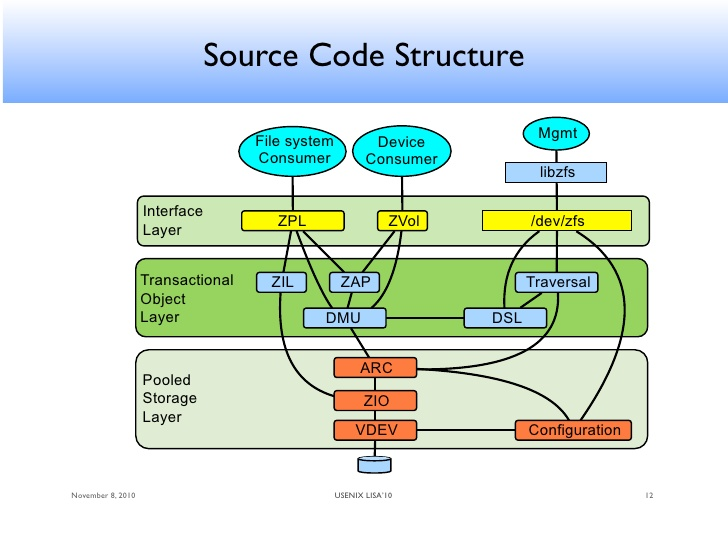
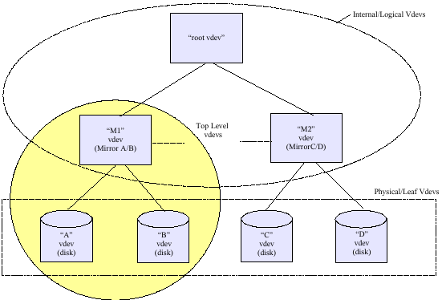
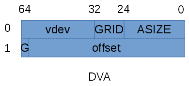
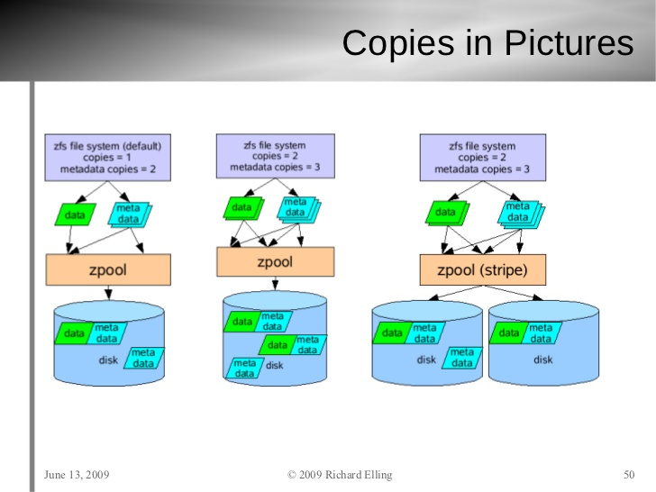
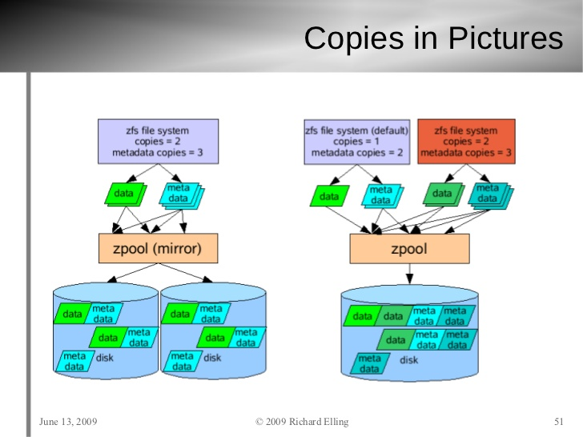
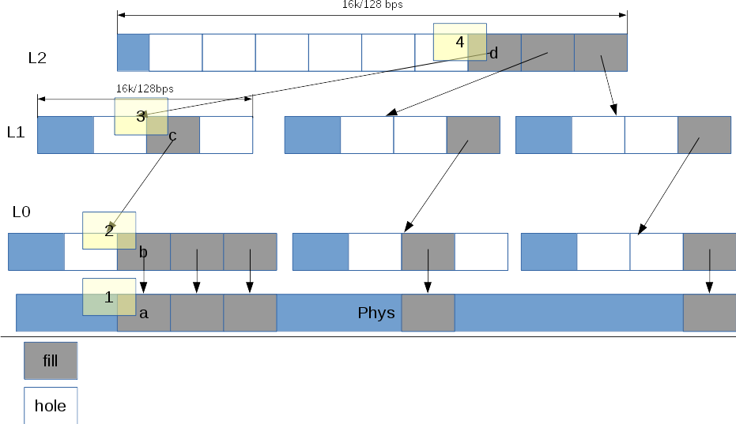
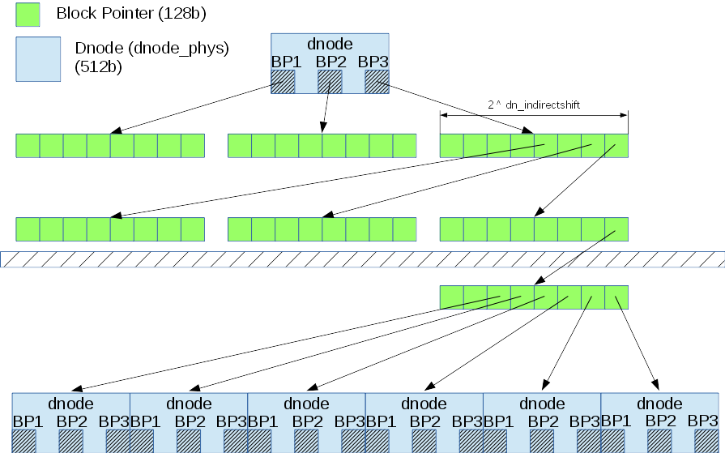

# Содержание
  * [ZFS](#zfs)
    * [Термины и сокращения](#Термины-и-сокращения)
    * [ZFS Label](#zfs-label)
      * [Конфигурация пула (ZFS Label NVList)](#Конфигурация-пула-zfs-label-nvlist)
      * [Уберблоки (Uberblocks)](#Уберблоки-uberblocks)
      * [Просмотр меток](#Просмотр-меток)
    * [Указатели на блоки (Block Pointers)](#Указатели-на-блоки-block-pointers)
      * [Косвенные блоки (indirect blkptr) и размеры блоков](#Косвенные-блоки-indirect-blkptr-и-размеры-блоков)
      * [Заполненность блоков (fill/hole)](#Заполненность-блоков-fillhole)
      * [Встраиваемый BP (embedded blkptr)](#Встраиваемый-bp-embedded-blkptr)
      * [Gang-блоки (Gang Blocks)](#gang-блоки-gang-blocks)
      * [Типы объектов ZFS](#Типы-объектов-zfs)
    * [Объекты и слой DMU](#Объекты-и-слой-dmu)
      * [MOS](#mos)
      * [Косвенные блоки и объекты](#Косвенные-блоки-и-объекты)
    * [Пример создания датасета типа ZVOL ](#Пример-создания-датасета-типа-zvol)
    * [DBUF](#dbuf)
      * [Реализация COW-механизма в DBUF](#Реализация-cow-механизма-в-dbuf)
    * [ZIO](#zio)
      * [Конвейер ZIO](#Конвейер-zio)
    * [VDEV](#vdev)
      * [Обобщённый интерфейс устройств VDEV](#Обобщённый-интерфейс-устройств-vdev)
      * [Особенности VDEV типа disk](#Особенности-vdev-типа-disk)
      * [Особенности VDEV типа raidz](#Особенности-vdev-типа-raidz)
    * [ARC](#arc)
      * [Отличия ARC в ZoL от оригинального (академического) ARC](#Отличия-arc-в-zol-от-оригинального-академического-arc)
    * [SPA](#spa)
      * [Принципы блокировок в SPA слое](#Принципы-блокировок-в-spa-слое)
    * [Отладка ZFS ](#Отладка-zfs)
      * [Сборка отладочной версии ZFS ](#Сборка-отладочной-версии-zfs)
      * [Утилита zdb ](#Утилита-zdb)
      * [Содержимое /proc/spl ](#Содержимое-procspl)

# ZFS

В данном документе представлены результаты исследований исходников ZFSonLinux-0.6.5.4.
В некоторых случаях используются иллюстрации из презентаций и документов Oracle, OpenSolaris, FreeBSD.
Это используется в тех случаях, когда документация из других реализаций ZFS не конфликтует с ZoL.

## Термины и сокращения 

Обратите внимание, к примеру, на разницу между zfs и ZFS:

* ZFS - под этим термином понимается вся система;

* zfs - только файловая система в ZFS (которая опирается на ZPL);

* ZPL - (ZFS POSIX Layer) подсистема, предоставляющая API для работы файловой системы zfs;

* ZVOL - подсистема блочных устройств. В некоторых случаях является синонимом фразы "объект типа DMU_OT_ZVOL";

* zvol - блочное устройство, выделяемое из пула в виде датасета.

* vdev (VDEV) - узел дерева, из которого состоит пул. Если узел является листовым, то это реальное устройство, если нет - виртуальное (mirror, raidz etc);

* SPA - (Storage Pool Allocator) - подсистема, отвечающая за управление занятым/свободным местом в пуле. Оперирует указателями на блоки (blkptr);

* blkptr (BP,БП) - указатель на область/области диска. Может быть пустым (HOLE) и заполненным (FILL);

* ZIO - (ZFS I/O) - подсистема ввода/вывода. Управляет процессом записи/чтения данных с дисков;

* ARC - (Adaptive Replacement Cache) - подсистема, отвечающая за кэширование данных. Через неё проходят все запросы к ZIO;

* arc, l2arc - кэш на чтение первого (память) и второго уровня (диски).

* DMU - (Data Managment Unit) - подсистема, оперирующая объектами ZFS, которые в свою очередь опираются на blkptr'ы. Все объекты описываются при помощи dnode-стуртуры.

* dnode (DN) - (data node) - структура, описывающая некий объект ZFS.

* `*_phys` - суффикс, который соответствует OnDisk-формату. Например, `dnode_phys`, `objset_phys`;

* OnDisk-формат - формат хранения данных непосредственно на физических носителях);

* DSL - (Datasets and Snapshots Layer) - подсистема, оперирующая датасетами и снапшотами. Опирается на DMU.

* ZIL - (ZFS Intent Log) - подсистема, необходимая для обработки синхронных запросов на запись. Может быть представлена в виде устройства SLOG (LogZilla, кэш на запись).

* ZAP - (ZFS Attibute Processor) - подсистема, необходимая для хранения свойств (аттрибутов) различных объектов ZFS, например, свойства файлов или датасетов.

* TXG - (Transaction Group) - группа транзакций. Используется в DMU.

* DBUF - (DMU Buffer) - подсистема, отвечающая за транзакционную запись и COW-механизм.

* Uberblock - блок данных на диске, характеризующий состояние системы на определённый момент времени (точнее - для определённой транзакционной группы).

* ZFS Label - метка на диске/разделе, по которой определяется принадлежность к ZFS.

* `Metaslab, Metaslab Group, Metaslab Class` - объекты, отвечающие за выделение места на в пуле. Хранят информацию о свободном/занятом месте. Имеют OnDisk-формат. Относятся к SPA.

* Indirect blocks - косвенные блоки;

* DVA - (Device Virtual Address) - 128-битный адрес, определяющий область на vdev'е, расположенную по заданному смещению и имеющую заданный размер;

* Gang block - набор блоков небольшого размера, которые предствляются как единый блок. Используются в случае сильной фрагментации;

* BIO (Block IO) - подсистема блочного ввода/выовда ядра Linux;

* NVPair (NVList) - списки пар имя-значение;

* guid - GUID;

* shift - логарифм по основанию 2 для некоторого значения. Например, утверждение "block shift = 9" эквивалентно утверждению "block size = 512b".

* P2PHASE, P2ROUNDUP, P2ALIGN - битовые операции (округление вниз, округление вверх, выравнивание по степеням двойки);

* MOS (Meta Object Set) - объект содержащий информацию о пуле. TODO: уточнить.

* `MetaNode` - метаобъект в датасете или пуле. Содержит в себе дерево, листья которого указывают на объекты датасета/пула. Всегда имеет номер 0;


Часть из предствленных термиров изображена на рис. 1.




## ZFS Label

В данном разделе описаны особенности меток ZFS, и, свзязанных с ними процессов.

Метки ZFS присутствуют на физическом носителе, если на него производится запись данных (обычные диски в raidz, mirros и slog).
Для повышения надёжности на диске присутствуют 4 метки - две в начале диска и две в конце (по номерам, соответственного, 1, 2 и 3, 4).
Кроме того, при обновлении данных в метках вначале обновляются первая и третья, а потом - вторая и четвёртая.
Это также повышает отказоустойчивость: если произошла ошибка при записи одной из пар, то может использоваться другая пара.

Рассмотрим структуры меток (рис. 2). В каждой метке присутствуют NVList с описанием конфигурации пула и массив уберблоков.
Перед первой парой меток дополнительно отступается свободное пространство (8k) под EFI-метки и место под `Boot Block Header` (8k).
В текущей реализации `Boot Block Header` просто заполняется нулями с контрольной суммой от этих нулей при создании меток.


### Конфигурация пула (ZFS Label NVList)

В NVList хранится информация о пуле и части соседних с текущим vdev'ов.
Как было раннее указано, хранится информация только о важных (с точки зрения целостности данных) vdev'ах - диски с данными и slog.
Другие виды vdev'ов (l2cache, spare) хранятся вне меток (непосредственно внутри пула).
"Соседние" vdev'ы - те устройства (виртуальные и реальные) с которыми граничит данное устройство в дереве vdev'ов пула.
Например, для пула, изображенного на рис. 3 в местах устройств A и B будет храниться информация о vdev'ах A, B, M1.



NVList конфигурации пул включает в себя следующие элементы:

* версия OnDisk-формата;

* имя пула;

* состояние пула (активный, экспортированный, уничтоженный);

* номер транзакционной группы, в которой была записана метка;

* guid пула;

* guid vdev'а верхнего уровня;

* дерево соседних vdev'ов;

Дерево vdev'ов содержит элементы - массив, состоящий из элементов:

* type: имя типа (диск, файл, зеркало и т.п.);

* id: уникальный индекс vdev'а в родительском vdev'е;

* guid vdev'a;

* path: путь к устройству (только для "листовых" vdev'ов - диски, файлы)

* metaslab_array: номер объекта (внутри пула), который содержит массив номеров объектов, каждый из которых соответствует объекту, описывающему metaslab;

* metaslab_shift: log2 от размера метаслаба;

* ashift (allocatable shift): log2 от размера минимальной области, которая может быть выделена в top-level vdev'е. Например, если ashift=9, то в данном vdev'е области будут выделяться не меньшие, чем 512 байт;

* asize (allocatable size): количество байт, которое можно выделить в данном vdev'е. Грубо говоря, общий объем всех дочерних vdev'ов;

* children: список дочерних vdev'ов;


### Уберблоки (Uberblocks)

Следующий элемент метки - уберблоки (Uberblocks). В текущей реализации используется массив из 128 уберблоков. Размер уберблока - 1k.
ZFS работает с уберблоками как с кольцевым буффером: при обновлении перезаписывается самый старый уберблок.
Таким образом, теоретически, мы в любой момент времени имеем до 128 readonly состояний файловой системы.
При поиске уберблока (во время операции импорта) выбирается уберблок, соответствующий следующим критериям:

* верная контрольная сумма;

* наибольшее значение временной метки;

* наибольшее значение номера транзакционной группы;

В случае, если существуют проблемы при импорте пула, ZFS позволяет производить операцию отмотки (REWIND), которая соответствует опциям `-F` и `-X` команды `zpool import`.
Отмотка позволяет "откатиться" в одно из предыдущих состояний файловой системы посредством выбора более "молодого" уберблока (своего рода перемещение во времени в рамках последних 128 транзакций).
Кроме того, существует опция `-T`, которая позволяет задать конкретный номер транзакции, к которой нужно откатиться.

Уберблок состоит из следующих элементов:

* ub_magic: уникальное "магическое" число (magic number), которое позволяет не только определить, что область на диске содержит уберблок, но определить порядок байт,
определённый в пуле (ZFS пулы переносимы между системами с различными `endianness`):

	- Big-Endian: 0x00bab10c (oo-ba-block)
	- Little-Endian: 0xcb1ba00

* ub_version: версия OnDisk-формата (см. версию в NVList)

* ub_txg: номер транзакционной группы, в которой был записан данный уберблок. Должен быть не меньше, чем параметр `txg` в метке;

* ub_guid_sum: сумма guid всех листовых vdev'ов. Используется для проверки доступности всех vdev'ов пула. Если это поле не совпадает с вычисленной при импорте суммой, значит было потеряно устройство;

* ub_timestamp: временная метка на момент записи уберблока;

* ub_rootbp: blktr, указывающий на расположение MOS (Meta Object Set) данного пула;


### Просмотр меток

Для просмотра содержимого меток пула можно воспользоваться командой `zdb <pool-name>`. 
Или `zdb <pool-name> -e -p <dir>` если пул был экспортирован и файлы/диски, из которых состоит пул находятся в директории `<dir>`.


## Указатели на блоки (Block Pointers)

Данные передаются между памятью и диском в единицах, которые называются блоками. Указатель на блок (структура blkptr_t) -
это 128-битная структура, используемая для описания физического расположения блока, его верификации. Она описывает блоки данных на диске.
Структура BP представлена на рис. 4.


На рис. 5 представлена структура DVA (Device Virtual Address). Она состоит из следующих элементов:

* asize (allocated size): размер данных (в единицах ashift vdev'а верхнего уровня), на которые указывает данный BP.
Стоит отметить, что данный параметр имеет наибольший размер (в битах) по отношению к LSIZE и PSIZE (см. поля BP), т.к.
дополнительно может понадобиться место для хранения данных GANG-блоков, RAIDZ и 3-х DVA на один BP.

* grid: зарезервировано для raidz;

* vdev: уникальный номер vdev'а в пуле;

* offset: смещение в единицах ashift, которое характеризует расположение блока в пуле ($phys addr = (offset << ashift) + Label_{size}$, где $Label_{size} = 4MB$ = 0.5МБ отступ первых 2-х меток + 3.5МБ свободного места)

* G (Gang): флаг, характиризующий, является ли блок Gang-блоком (0 - нет, 1 - да).



Как было отмечено выше, в BP может содержаться до 3-х DVA. Это значит, что один BP может ссылаться на данные в 3-х различных местах пула.
Это сделано для повышения надёжности хранения данных, в особенности - метаданных. Ведь потеря метаданных (например, косвенного блока или dnode'ы) может оказать существенное влияние на целостность данных в пуле.
К примеру, если мы "потеряем" данные, на которые указывает `ub_rootbp` уберблока, то мы потеряем все данные. Чтобы не допустить это, используется избыточность для метаданных.
Количество избыточных DVA зависит от вида BP (данные/метаданные) и типа метаданных (чем выше по дереву - тем большая избыточность).
На рис. 6-7 изображены примеры количества и расположения блоков на различных видах пулов.








Избыточность по DVA задаётся посредством параметра `copies` в свойствах датасета 
(для существующего датасета выполнение команды `zfs set <pool/ds> copies=N` приведёт к тому, 
что новые данные будут дублироваться, однако на старые блоки это не окажет влияния. Также этот параметр можно задавать при создании датасета).


Рассмотрим подробнее поля bklptr_t, представленные на рис. 4:

* `DVA[3]`: 3 128-битных адреса;

* B (byteorder, endianness): флаг, определяющий порядок байт;

* D (dedup): флаг, определяющий наличие дедупликации;

* X (encryption): флаг, определяющий наличие шифрования (в текущей версии не поддерживается);

* lvl (indirection level): уровень косвенности для косвенных блоков. Блоки, указывающие на данные содержат значение 0 (`L0`).

* type: тип объекта, к которому относится данный BP (см. ниже, константы вида `DMU_OT_*`);

* cksum: тип контрольной суммы и включена ли она. Значение этого поля интерпретируется в зависимости от типа блока;

* E: флаг, определяющий, является ли BP встроенным (embedded BP, см. ниже). В старых версиях ZFS отсутствует;

* comp: тип компрессии и включена ли она;

* padding: неиспользуемые/зарезервированные поля (пока что используются в целях выравнивания);

* phys birth txg (physical birth txg): номер транзакции, в результате которой было выделено место под данные, на который указывает данный BP.
В случае, если phys birth txg == 0, то считается, что блок был данных был выделен в тот же момент, когда появился данный BP (т.е. phys birth txt == log birth txt).

* log birth txg (logical birth txg): номер транзакции, в результате которой появился данный BP;

* fill count: количество заполненных блоков, которые находятся ниже данного в дереве косвенных блоков. Для блока, указывающего на данные (`L0`) fill count всегда равен 1;

* `checksum[4]`: значение контрольной суммы данного блока;


### Косвенные блоки (indirect blkptr) и размеры блоков

Размеры BP, как правило, ограничены параметрами датасетов `volblocksize (zvol)` и `recordsize (zfs)`. В свою очередь, на эти параметры накладываются следующие ограничения:

* blocksize не может быть меньше, чем `ashift` (невозможно выделить блоки, меньшие, чем размер логического блока дисков пула);
* blocksize не может быть больше, чем `zfs_max_recordsize` (параметр модуля ядра);

Параметр `zfs_max_recordsize` по умолчанию равен 1М, максимальное значение - 16M. Теоретический максимум этого значения равен максимальному значению поля `LSIZE * ashift`
в BP (т.е. 32M), однако поле `dn_datablkszsec` может хранить не более, чем `32M - 512` байт. Поэтому максимум `zfs_max_recordsize` ограничен 16МБ (P2PHASE от 32M - 512).


В случае, если возникает необходимость хранения данных больших, чем размер блока, необходимы косвенные блоки (indirect blocks).
Косвенные блоки образуют дерево косвенных блоков (рис. 8). На каждый узел дерева выделяется место, равное `DNODES_PER_BLOCK` (в данный момент - 16k).
Учитывая размер blkptr равный 128B, в косвенный блок может содержать до 128 указателей на блоки. Место под косвенные блоки выделяется сразу и заполняется по мере наполнения
соответствующего узла.




### Заполненность блоков (fill/hole)

Каждый blkptr может либо указывать на данные (в случае, если в хотя бы один DVA в нём ненулевой), либо быть "дыркой" (HOLE) - пустой указатель.
В ранних версиях пустые указатели имели все поля, равные нулю. В новых версиях пулов, в которых включена фича "hole_birth" у данного вида указателей
присутствует поле birth txg, которое характеризует время (номер транзакционной группы) появления данного указателя.
Данная фича позволяет сократить объем данных, пересылаемых при помощи `zfs send|recv`.


### Встраиваемый BP (embedded blkptr)

Ещё одна фича новых пулов - "embedded_data". Это особый вид BP, которые содержат данные в самих себе. Это сделано для того, чтобы
уменьшить время доступа к мелким блокам: вместо того, чтобы идти по адресу, содержащемся в DVA, мы можем сразу считать данные из полей BP.
TODO: данный вид BP имеет структуру, отличную от обычных BP, кроме того, запись таких блоков производится иначе.
Так что в дальнейшем сюда можно будет добавить их описание.

### Gang-блоки (Gang Blocks)

Как было замечено выше, в случае, если ZFS не может выделить места, достаточного для блока, она выделяет несколько блоков меньшего размера,
и оперирует ими как одним целым.
TODO: так же, как и embedded BP, Gang-блоки имеют несколько иное поведение при операциях ввода/вывода. Это тоже можно будет добавить.


### Типы объектов ZFS

Одно из полей `blkptr_t` - `type` характеризует тип объекта, к которому относится данный BP.
В табл. 1 представлены несколько таких типов.


| Название типа             | Описание/тип                    |
| ------------------------- | ------------------------------- |
| DMU_OT_NONE               | -                               |
| General types:            |                                 |
| DMU_OT_OBJECT_DIRECTORY   | Объект ZAP                      |
| DMU_OT_OBJECT_ARRAY       | UINT64                          |
| DMU_OT_PACKED_NVLIST      | UINT8 (XDR-кодированный nvlist) |
| DMU_OT_PACKED_NVLIST_SIZE | UINT64                          |
| DMU_OT_BPOBJ,             | UINT64                          |
| DMU_OT_BPOBJ_HDR,         | UINT64                          |
| SPA types:                |                                 |
| DMU_OT_SPACE_MAP_HEADER   | UINT64                          |
| DMU_OT_SPACE_MAP          | UINT64                          |
| ZIL types:                |                                 |
| DMU_OT_INTENT_LOG         | UINT64                          |
| ZVOL types:               |                                 |
| DMU_OT_ZVOL               | UINT8                           |
| DMU_OT_ZVOL_PROP          | Объект ZAP                      |

Table: Некоторые виды DMU объектов

Например, в датасете `zvol` присутствует 2 объекта - `ZVOL` и `ZVOL_PROP`. 
Первый объект относится к данным, которые представляет `zvol`, второй - свойства `zvol`'а (например, `volblocksize`).
Все BP, на которые прямым и косвенным образом ссылается первый объект в поле `type` будут содержать значение `DMU_OT_ZVOL`.


## Объекты и слой DMU

В данном пункте будут подробно рассмотрены объекты `ZFS`, т.к. они составляют большую часть системы
и являются абстракцией, упрощающей работу с `BP`.

Основной структурой, связанной с объектами является `dnode`, которая представлена в `OnDisk`-формате в виде `dnode_phys`.
Рассмотрим её основные поля:

* `dn_type`: тип объекта, с которым связана данная DN (`dmu_object_type_t`);

* `dn_indblkshift`: log2 от `indirect block size` - размера косвенных блоков;

* `dn_nlevels`: число уровней косвенности. Если 1, то `dn_blkptr` указывает на блоки данных;

* `dn_nblkptr`: длина поля dn_nblkptr (точнее - количество задействованных указателей). Значения - от 1 до 3;

* `dn_bonustype`: тип данных в bonus-буффере;

* `dn_checksum`: тип контрольной суммы (`enum zio_checksum`);

* `dn_compress`: тип сжатия (`enum zio_compress`);

* `dn_flags`: флаги
	- `DNODE_FLAG_USED_BYTES (1<<0)`: dn_used использует байты? если нет, то `dn_used` в качестве единиц использует `SPA_MINBLOCKSIZE` (512b)
	- `DNODE_FLAG_USERUSED_ACCOUNTED (1<<1)`: TODO
	- `DNODE_FLAG_SPILL_BLKPTR (1<<2)`: имеет ли данный объект системные аттрибуты в bonus-буффере (TODO: уточнить)

* `dn_datablkszsec`: размер блока данных в 512b секторах;

* `dn_bonuslen`: длина dn_bonus (bonus-буффер в объединении dn_nblkptr);

* `dn_pad2[4]`: зарезервировано/дополнение для выравнивания

* `dn_maxblkid`: наибольший ID выделенного блока (TODO: описать, как вычисляется/используется)

* `dn_used`: объём используемого дискового пространства (в байтах или секторах в зависимости от `dn_flags`)

* `dn_pad3[4]`: зарезервировано/дополнение для выравнивания

* `dn_blkptr`: объединение, которое может использоваться тремя различными способами:
```
0       64      128     192     256     320     384     448 (offset)
+---------------+---------------+---------------+-------+
| dn_blkptr[0]  | dn_blkptr[1]  | dn_blkptr[2]  | /     |
+---------------+---------------+---------------+-------+
| dn_blkptr[0]  | dn_bonus[0..319]                      |
+---------------+-----------------------+---------------+
| dn_blkptr[0]  | /                     | dn_spill      |
+---------------+-----------------------+---------------+
```

### MOS

TODO: добавить описание Meta Objset пула - метаобъекта (контейнера объектов) пула, в котором содержится
дополнительная информация о конфигурации пула, директории датасетов (DSL directory), карты датасетов (DSL child map),
метаобъекты датасетов (Dataset), метаслабы, карты пространств и другие виды объектов.
Также можно добавить пример получения доступа к датасету:
`MOS -> object=1.root_dataset -> ... linked list ... -> DSL directory (parent) -> DSL directory (child) -> "DSL dataset".bp -> Dataset`


### Косвенные блоки и объекты

dnode предоставляет механизмы работы с косвенными блоками. Рассмотрим датасет типа ZVOL.
После создания он состоит из следующих компонентов:

* Meta Node (можно получить через макрос `DMU_META_DNODE(objset)`), номер объекта равен 0;

* `ZVOL`-объект, номер объекта равен 1;

* `ZVOL_PROP`-объект, номер объекта равен 2;

Рассмотрим объект `Meta Node`. Данный объект представляет собой дерево из $levels$ уровней.
Значение $levels = lvl$ должно удовлетворять следующему условию:

$$ nblkptr * 2 ^ {(datablkshift + (lvl - 1) * (indblkshift - BPSHIFT))} >= MAX\_OBJECT * size_{dnode} $$, где 

* `nblkptr`, `datashift`, `indblkshift` - соответствующие поля структуры `dnode`;

* `BPSHIFT (SPA_BLKPTRSHIFT)` - размер структуры blkptr_t (128b);

* `MAX_OBJECT (DN_MAX_OBJECT)` - максимальный размер объекта ($2 ^ {48}$ байт);

* $size_{dnode}$ - размер структуры `dnode_phys` в байтах;

Если выполнить преобразования:

* Размер блока данных в байтах: $blksize = 2 ^ {datablkshift}$;

* Количество BP, которые можно разместить в одном косвенном блоке: $ind\_per\_bp = {(2 ^ {ind}) / (2 ^ {BPSHIFT})}$;

* Максимальный размер объекта, состоящего из `dnode_phys` в байтах: $max\_obj = MAX\_OBJECT * size_{dnode}$;

То получим:

$$ nblkptr * blksize *  ind\_per\_bp ^ {lvl-1} >= max\_obj$$

Учитывая, что количество элементов в дереве на глубине $lvl$ равна $ind\_per\_bp ^ {lvl}$,
то неравенство отражает тот факт, дерево должно быть достаточной глубины, для того, чтобы
вместить в себя метаобъект максимально возможного размера.
Например, `dnode` с `levels = 3` и `dn_nblkptr = 2` может оперировать с объектом, 
который состоит из $2 * 128 ^ {3 - 1}$ блоков (128 - количество косвенных блоков, умещающихся на одном уровне).

`MetaNode` (объект с нулевым индексом) содержит в себе все объекты датасета. 
В случае `ZVOL`-датасета, там хранятся два объекта `DMU_OT_ZVOL` и `DMU_OT_ZVOL_PROP`.

В объекте `DMU_OT_ZVOL` также могут использоваться косвенные блоки.

Важно отметить, что в объекте `MetaNode` хранится дерево, состоящее из `dnode_phys`,
а в качестве ссылок на узлы используются указатели `dnode_phys.dn_blkptr`.
А в объекте типа `ZVOL` дерево состоит только из `blkptr_t`, 
в качестве ссылок там используются `DVA` (см. рис. 8).

Рассмотрим алгоритм обхода косвенных блоков (из zdb.c):

```c

void traverse_indirect(int objset, int object, int level, int blkid, bp) {
	// level: N
	// objset:  number in parent MetaNode object tree
	// bp:  current bp with level = L(N)
	blkptr_t *cbp; // child bp with level = L(N - 1)

	do_something(bp);

	if (BP_GET_LEVEL(bp) > 0 && !BP_IS_HOLE(bp)) {
		arc_buf_t *buf;
		// element per block = bp.lsize / sizeof(bp)
		int epb = BP_GET_LSIZE(bp) >> SPA_BLKPTRSHIFT; 
		buf = arc_read(bp); //pseudo-code
		for(i = 0; i < epb; i++, cbp++)
		{
			traverse_indirect(
				objset, 
				object, 
				level - 1, 
				blkid * epb + i, 
				cbp
			);
		}
		
	}

}
```

На рис. 9 изображено дерево, из которого состоит объект `DMU_OT_DNODE`. Если сравнить его с деревом blkptr (рис. 8),
то заметно два отличия: корень и листья в метаобъекте являются элементами `dnode_phys`.
На корень этого дерева указывает объект типа dataset из метаданных пула. А листья - указывают на объекты (метаданные) самого датасета.




## Пример создания датасета типа `ZVOL`

TODO: добавить описание стека вызовов функций, которые используются для создания датасета.


## DBUF

### Реализация COW-механизма в DBUF

## ZIO

### Конвейер ZIO

## VDEV

### Обобщённый интерфейс устройств VDEV

### Особенности VDEV типа disk

### Особенности VDEV типа raidz

## ARC

### Отличия ARC в ZoL от оригинального (академического) ARC

## SPA

### Принципы блокировок в SPA слое


## Отладка `ZFS`

### Сборка отладочной версии `ZFS`

### Утилита `zdb`

### Содержимое `/proc/spl`


## to delete

### Как получить `dnode`?

```
dnode_hold(metanode, object) -> dnode_hold_impl(os, object) -> 
{ blkid (offset) = which_blk(os->meta, object); dbuf_hold(meta, blk); } -> dbuf_hold_impl -> __dbuf_hold_impl ->
{ dbuf = dbuf_find(os, object, level, blkid); -> dbuf = dbuf_hash_table[(os, obj, lvl, blkid)]; } ->
{ while dbuf has not data then walk to parent and create new dbuf } ->
```


Однако, стоит отметить, что в ZFS присутствует механизм отложенного удаления блоков, задающий задержку (в номерах транзакций) перед удалением. 
Таким образом, если в результате транзакции $N$ был удалён файл, и не было снапшотов, связанных с этим файлом,
то ZFS не гарантирует, что при откате в транзакцию, скажем, $N - 10$ он будет присутствовать в системе.

