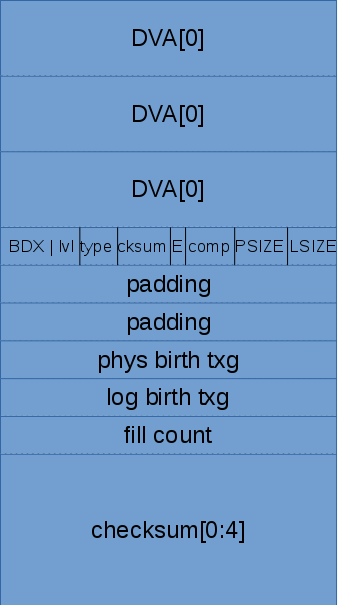

## Указатели на блоки (Block Pointers)

Данные передаются между памятью и диском в единицах, которые называются блоками. Указатель на блок (структура blkptr_t) -
это 128-битная структура, используемая для описания физического расположения блока, его верификации. Она описывает блоки данных на диске.
Структура BP представлена на рис. @fig:zfs-blkptr-struct.

{#fig:zfs-blkptr-struct}

На рис. 5 представлена структура DVA (Device Virtual Address). Она состоит из следующих элементов:

* asize (allocated size): размер данных (в единицах ashift vdev'а верхнего уровня), на которые указывает данный BP.
Стоит отметить, что данный параметр имеет наибольший размер (в битах) по отношению к LSIZE и PSIZE (см. поля BP), т.к.
дополнительно может понадобиться место для хранения данных GANG-блоков, RAIDZ и 3-х DVA на один BP.

* grid: зарезервировано для raidz;

* vdev: уникальный номер vdev'а в пуле;

* offset: смещение в единицах ashift, которое характеризует расположение блока в пуле ($phys addr = (offset \ll ashift) + Label_{size}$, где $Label_{size} = 4MB$ = 0.5МБ отступ первых 2-х меток + 3.5МБ свободного места)

* G (Gang): флаг, характиризующий, является ли блок Gang-блоком (0 - нет, 1 - да).

")

Как было отмечено выше, в BP может содержаться до 3-х DVA. Это значит, что один BP может ссылаться на данные в 3-х различных местах пула.
Это сделано для повышения надёжности хранения данных, в особенности - метаданных. Ведь потеря метаданных (например, косвенного блока или dnode'ы) может оказать существенное влияние на целостность данных в пуле.
К примеру, если мы "потеряем" данные, на которые указывает `ub_rootbp` уберблока, то мы потеряем все данные. Чтобы не допустить это, используется избыточность для метаданных.
Количество избыточных DVA зависит от вида BP (данные/метаданные) и типа метаданных (чем выше по дереву - тем большая избыточность).
На рис. 6-7 изображены примеры количества и расположения блоков на различных видах пулов.

")

")

Избыточность по DVA задаётся посредством параметра `copies` в свойствах датасета 
(для существующего датасета выполнение команды `zfs set <pool/ds> copies=N` приведёт к тому, 
что новые данные будут дублироваться, однако на старые блоки это не окажет влияния. Также этот параметр можно задавать при создании датасета).

Рассмотрим подробнее поля bklptr_t, представленные на рис. 4:

* `DVA[3]`: 3 128-битных адреса;

* B (byteorder, endianness): флаг, определяющий порядок байт;

* D (dedup): флаг, определяющий наличие дедупликации;

* X (encryption): флаг, определяющий наличие шифрования (в текущей версии не поддерживается);

* lvl (indirection level): уровень косвенности для косвенных блоков. Блоки, указывающие на данные содержат значение 0 (`L0`).

* type: тип объекта, к которому относится данный BP (см. ниже, константы вида `DMU_OT_*`);

* cksum: тип контрольной суммы и включена ли она. Значение этого поля интерпретируется в зависимости от типа блока;

* E: флаг, определяющий, является ли BP встроенным (embedded BP, см. ниже). В старых версиях ZFS отсутствует;

* comp: тип компрессии и включена ли она;

* padding: неиспользуемые/зарезервированные поля (пока что используются в целях выравнивания);

* phys birth txg (physical birth txg): номер транзакции, в результате которой было выделено место под данные, на который указывает данный BP.
В случае, если phys birth txg == 0, то считается, что блок был данных был выделен в тот же момент, когда появился данный BP (т.е. phys birth txt == log birth txt).

* log birth txg (logical birth txg): номер транзакции, в результате которой появился данный BP;

* fill count: количество заполненных блоков, которые находятся ниже данного в дереве косвенных блоков. Для блока, указывающего на данные (`L0`) fill count всегда равен 1;

* `checksum[4]`: значение контрольной суммы данного блока;

### Косвенные блоки (indirect blkptr) и размеры блоков

Размеры BP, как правило, ограничены параметрами датасетов `volblocksize (zvol)` и `recordsize (zfs)`. В свою очередь, на эти параметры накладываются следующие ограничения:

* blocksize не может быть меньше, чем `ashift` (невозможно выделить блоки, меньшие, чем размер логического блока дисков пула);
* blocksize не может быть больше, чем `zfs_max_recordsize` (параметр модуля ядра);

Параметр `zfs_max_recordsize` по умолчанию равен 1М, максимальное значение - 16M. Теоретический максимум этого значения равен максимальному значению поля `LSIZE * ashift`
в BP (т.е. 32M), однако поле `dn_datablkszsec` может хранить не более, чем `32M - 512` байт. Поэтому максимум `zfs_max_recordsize` ограничен 16МБ (P2PHASE от 32M - 512).

В случае, если возникает необходимость хранения данных больших, чем размер блока, необходимы косвенные блоки (indirect blocks).
Косвенные блоки образуют дерево косвенных блоков (рис. 8). На каждый узел дерева выделяется место, равное `DNODES_PER_BLOCK` (в данный момент - 16k).
Учитывая размер blkptr равный 128B, в косвенный блок может содержать до 128 указателей на блоки. Место под косвенные блоки выделяется сразу и заполняется по мере наполнения
соответствующего узла.

")

### Заполненность блоков (fill/hole)

Каждый blkptr может либо указывать на данные (в случае, если в хотя бы один DVA в нём ненулевой), либо быть "дыркой" (HOLE) - пустой указатель.
В ранних версиях пустые указатели имели все поля, равные нулю. В новых версиях пулов, в которых включена фича "hole_birth" у данного вида указателей
присутствует поле birth txg, которое характеризует время (номер транзакционной группы) появления данного указателя.
Данная фича позволяет сократить объем данных, пересылаемых при помощи `zfs send|recv`.

### Встраиваемый BP (embedded blkptr)

Ещё одна фича новых пулов - "embedded_data". Это особый вид BP, которые содержат данные в самих себе. Это сделано для того, чтобы
уменьшить время доступа к мелким блокам: вместо того, чтобы идти по адресу, содержащемся в DVA, мы можем сразу считать данные из полей BP.
Данный вид BP имеет структуру, отличную от обычных BP, кроме того, запись таких блоков производится иначе.

### Gang-блоки (Gang Blocks)

Как было замечено выше, в случае, если ZFS не может выделить места, достаточного для блока, она выделяет несколько блоков меньшего размера,
и оперирует ими как одним целым.
Так же, как и embedded BP, Gang-блоки имеют несколько иное поведение при операциях ввода/вывода.

### Типы объектов ZFS

Одно из полей `blkptr_t` - `type` характеризует тип объекта, к которому относится данный BP.
В табл. 2 представлены несколько таких типов.

| Название типа             | Описание/тип                    |
| ------------------------- | ------------------------------- |
| DMU_OT_NONE               | -                               |
| General types:            |                                 |
| DMU_OT_OBJECT_DIRECTORY   | Объект ZAP                      |
| DMU_OT_OBJECT_ARRAY       | UINT64                          |
| DMU_OT_PACKED_NVLIST      | UINT8 (XDR-кодированный nvlist) |
| DMU_OT_PACKED_NVLIST_SIZE | UINT64                          |
| DMU_OT_BPOBJ,             | UINT64                          |
| DMU_OT_BPOBJ_HDR,         | UINT64                          |
| SPA types:                |                                 |
| DMU_OT_SPACE_MAP_HEADER   | UINT64                          |
| DMU_OT_SPACE_MAP          | UINT64                          |
| ZIL types:                |                                 |
| DMU_OT_INTENT_LOG         | UINT64                          |
| ZVOL types:               |                                 |
| DMU_OT_ZVOL               | UINT8                           |
| DMU_OT_ZVOL_PROP          | Объект ZAP                      |

Table: Некоторые виды DMU объектов (2)

Например, в датасете `zvol` присутствует 2 объекта - `ZVOL` и `ZVOL_PROP`. 
Первый объект относится к данным, которые представляет `zvol`, второй - свойства `zvol`'а (например, `volblocksize`).
Все BP, на которые прямым и косвенным образом ссылается первый объект в поле `type` будут содержать значение `DMU_OT_ZVOL`.

