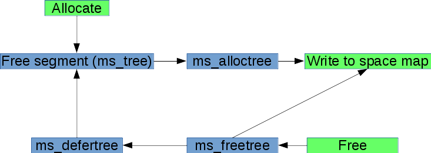

## SPA

SPA (Storage Pool Allocator) - подсистема, отвечающая за низкоуровневую работу с пулом.
Она решает следующие вопросы:

* выделение места под новые блоки (с использованием концепции [метаслабов](#метаслабы));

* синхронизация пула (запись [транзакционных групп](#транзакционные-группы-txg));

* управление виртуальными устройствами - (дерево [vdev](#vdev));

### Метаслабы

Причины использования метаслабов для манипуляции с пространством пула описаны в соответствующем разделе [space maps](#space-maps).

Каждый vdev (дочерний) разбивается на ~200 областей/элементов, называемых метаслабами.
Эти метаслабы образуют "группу метаслабов". Кроме того, каждая группа
метаслабов принадлежит некоторому "классу метаслабов".
В данный момент подобная "гибкость" не используется (один класс, одинаковые группы для всех vdev'ов),
однако заложена возможность задавать отдельные виды групп метаслабов для SLOG-устройств.

Рассмотрим элементы метаслаба, указанные в таблице @tbl:spa-ms-elems.

| Элемент метаслаба | Операция/назначение     | Размер массива     | Упорядоченность  |
| ----------------- | ----------------------- | ------------------ | ---------------- |
| alloc_tree        | выделение места         | TXG_SIZE = 4       | границы сегмента |
| free_tree         | освобождение места      | TXG_SIZE = 4       | границы сегмента |
| defer_tree        | отложенное освобождение | TXG_DEFER_TREE = 2 | границы сегмента |
| ms_tree           | текущее состояние,      | 1                  | границы сегмента |
| size_tree         | дублирует `ms_tree`     | 1                  | размер сегмента  |
| ms_lbas           | массив курсоров на LBA  | MAX_LBAS = 64      | -                |

Table: Элементы метаслаба {#tbl:spa-ms-elems}

Каждый метаслаб управляет набором активных деревьев для отслеживания операций над ним.
Активное `free tree` (`ms_tree`) содержит текущий список свободных сегментов.
Когда блоки выделяются, выделенный под них сегмент удаляется из `ms_tree`
и добавляется в `allocation tree` (`ms_alloctree`, см. рис. @fig:metaslab-tree-stats)
в соответствии транзакционной группой, в рамках которой происходило выделение сегмента.
Когда блоки освобождаются, они добавляются в `free tree` (`ms_freetree`)
в соответствии транзакционной группой, в рамках которой происходило освобождение сегмента.

Таким образом, имеется массив из `TXG_SIZE` (`TXG_SIZE=4`) деревьев для каждого типа операций.

Эти деревья позволяют обрабатывать все операции выделения/освобождения в
контексте синхронизации, что позволяет безопасно обновлять `on-disk`-карты пространств.

Также существует активное дерево отложенного освобождения (`ms_defertree`).
Как только блок освобождается, он перемещается из `ms_freetree` в `ms_defertree`.
Отложенное освобождение означает, что блок будет удалён, но не будет использоваться
в пуле, пока не завершатся `TXG_DEFER_SIZE` транзакционных групп. Например, если блок
был удалён в транзакционной группе номер 50, то он будет доступен для последующего
выделения (реаллокации) только после 52-й транзакционной группы (`50 + TXG_DEFER_SIZE`).
Это позволяет использовать "безопасную сеть" для отката уберблоков. То есть, гарантируется,
что пул можно безопасно откатить на `TXG_DEFER_SIZE` транзакционных групп назад и
быть уверенным, что ни один блок этих групп не был перезаписан.

{#fig:metaslab-tree-stats}

Также в метаслабе присутствуют поля `ms_lbas` и `size_tree`.
Они могут использоваться аллокаторами блоков (`metaslab block allocators`).
`size_tree` содержит те же самые сегменты, что и `ms_tree`, только отсортированные
не по границам сегментов, а по их размерам.
Поле `ms_lbas` содержит адреса начала которые были получены в предыдущих аллокациях.
Например, если необходимо выделить блока размером 512 байт (`align == 9`),
будет выбран адрес `ms_lbas[9 - 1]` - 9-й элемент этого массива.
В нём может находится адрес предыдущего выделенного блока размером 512 байт.
Таким образом, аллокатор может помещать блоки одинакового размера рядом.

### Вес метаслаба

При аллокации места в пуле ZFS должна определить, в каком метаслабе нужно выделять блок/блоки.
Для этого используется механизм весов: для каждого метаслаба в группе (физ. диске) определяется "вес",
и этот вес учитывается при выборе метаслаба.

Рассмотрим основные параметры, по которым вычисляется вес:

* Удалено ли устройство?

* Количество свободного места.

* Количество свободного места и уровень фрагментированности метаслаба при установке параметра
`metaslab_fragmentation_factor_enabled = 1`.

* Удалённость метаслаба от начала диска (`metaslab_lba_weighting_enabled = 1`).

Кроме того, при выборе метаслаба для `ditto`- или `log`-блоков учытывается расстояние между `DVA`.
Выделяемые блоки должны быть либо на разных `vdev`-ах, либо в разных метаслабах, если
нет возможности выделить их на разных устройствах.

### Методы выделения сегментов

Выбор метода выделения места в метаслабе зависит от двух факторов:

1. Каков максимальный размер свободного блока в метаслабе? Меньше ли он 16MB?
2. Каков процент свободного места в метаслабе? Меньше ли он 4%?

Если хотя бы на один из этих вопросов будет положительный ответ, то ZFS переходит
от метода Dynamic block аллокатора к First-Fit аллокатору. Что, конечно же, сказывается на производительности.

TODO: Здесь будут описаны методы выделения блоков - first-fit и Dynamic block allocator.

